# 02 — Add web search to your AI assistant

Your assistant can help you build the game, but it should not guess when you
need current information. Give VS Code Chat a way to search for documentation
and other sources. This adds search to your **coding assistant**, not to the
game you are building.

## What is an agent tool?

Qwen is the language model that reasons about your request and writes a reply.
VS Code Chat hosts the agent and gives it access to **tools**: capabilities
such as reading files, running commands, or retrieving information. The model
can request a tool call; VS Code runs the tool and returns its result so the
model can continue. You can inspect those calls and may be asked to approve
them.

VS Code already has ways to access web pages. For example, its built-in
`web/fetch` tool can read a page when you know its URL, much like fetching it
with `curl`, and its browser tools can interact with pages. That is different
from giving the agent a dedicated **search-engine tool** that discovers pages
from a question. The extension in this assignment adds `websearch`: Tavily
performs the search, and Qwen uses the returned results. You are extending the
agent's tools, not replacing its model or setting up an MCP server. See
[VS Code's explanation of agent tools](https://code.visualstudio.com/docs/agents/concepts/tools)
for the broader picture.

## Install the VS Code extension

In the VS Code window where you use the Mechatronics model, open **Extensions**
and search for **Web Search for Copilot**.

[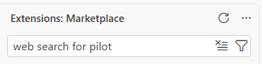](assets/02-extension-search.png)

Check that the extension is published by **Microsoft**, then install it.
You can also open its [VS Code Marketplace page](https://marketplace.visualstudio.com/items?itemName=ms-vscode.vscode-websearchforcopilot).

[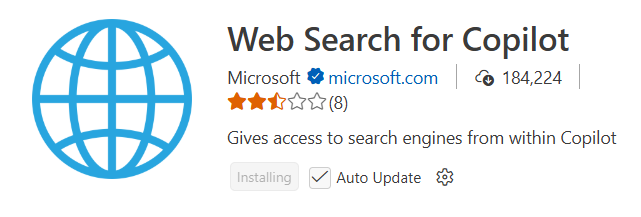](assets/02-extension-listing.png)

## Create a free Tavily account

The extension uses [Tavily](https://www.tavily.com/pricing) to search the web.
Tavily is a separate service from the Mechatronics LLM cluster, so it needs
its own account and API key. Create a Tavily account and continue through its
welcome screens.

[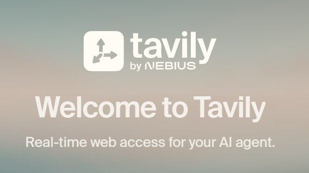](assets/02-tavily-welcome.png)

When asked to choose a plan, select **Continue on Free**. No credit card was
requested during our walkthrough. The free-credit amount and appearance of
this page may change, so use the current options rather than treating the
screenshot as a pricing promise. You do not need a paid plan for this exercise.

[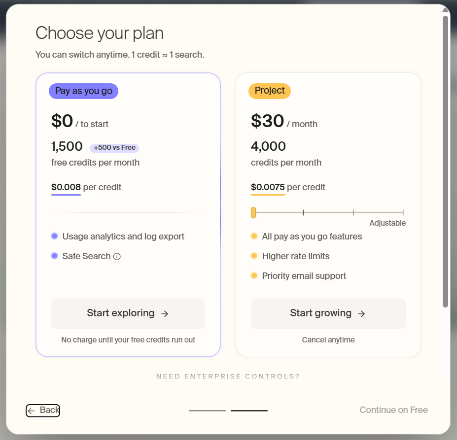](assets/02-tavily-free-plan.png)

## Create your Tavily API key

Once you reach Tavily's **Getting started** page, open **Manage keys**. Create
a key for VS Code; a name such as `vscode` and the **Development** key type are
fine. Copy the key when it is shown.

[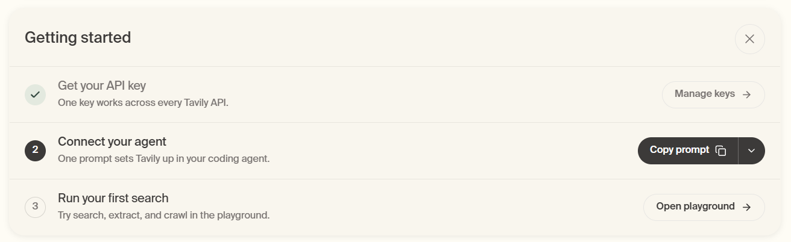](assets/02-tavily-getting-started.png)

[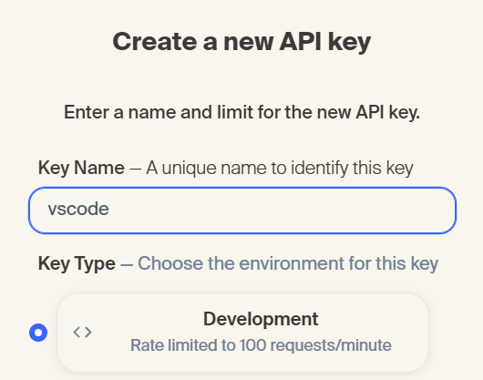](assets/02-create-tavily-key.png)

[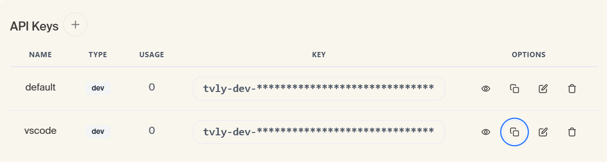](assets/02-tavily-key-list.png)

This is *not* your Mechatronics LLM key. Keep both keys private: do not paste
them into a chat message, a screenshot, or your game project.

You can ignore Tavily's generic **Copy prompt** step. We are connecting search
through the VS Code extension, not asking the coding assistant to install it.

## Look at your agent's tools

In VS Code Chat, select the Mechatronics Qwen model and **Agent** mode. Open
**Configure Tools** from the chat input. Expand **Web Search for Copilot** and
check that `websearch` is enabled. Notice the other tool groups too: they are
the actions your agent *can* take, not a promise that it will use all of them.

[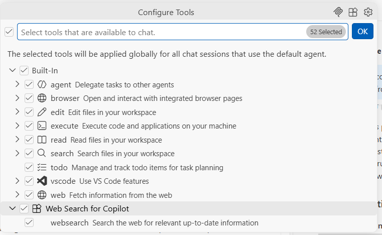](assets/02-vscode-tools.png)

Compare `websearch` with the built-in `web` and `browser` groups. Which one
would you use if you already had a documentation URL? Which one helps you find
the URL in the first place?

## Try a live search

In Agent chat, ask a question and explicitly reference the new tool by typing
`#websearch`. For example:

> `#websearch Find the current MDN documentation for the browser WebSocket API. Give me the source URL and two things relevant to a multiplayer game.`

On first use, VS Code may ask you to allow the extension to sign in with
Tavily. Check that the request comes from **Web Search for Copilot**, then
allow it and paste your Tavily key into the **masked Tavily Login** prompt—not
into the chat message.

[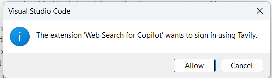](assets/02-vscode-tavily-allow.png)

[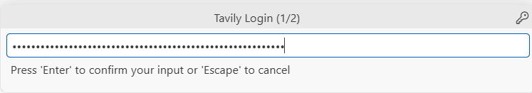](assets/02-vscode-tavily-key-prompt.png)

During our test, VS Code also requested a separate GitHub sign-in. If you see
that prompt, follow VS Code's authorization screen using your own GitHub
account. This is separate from your Tavily key and your Mechatronics LLM key;
it does not change the Qwen model you selected. The prompts you see may vary.

Look for an actual **Searching the web** tool call and source links in the
reply. A convincing answer alone does not prove the agent searched.

[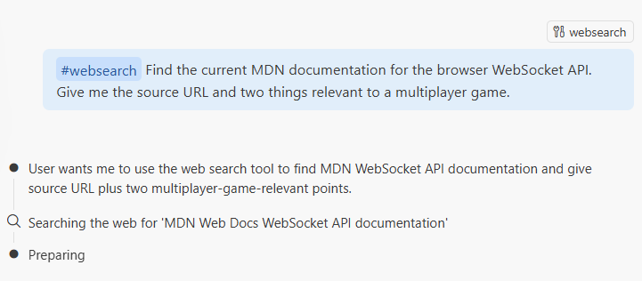](assets/02-vscode-first-search.png)

## Use it while building your game

Ask a current question about a library, browser API, or protocol you are
considering. You can try asking in ordinary language without `#websearch`,
but check whether the agent actually chose the tool. If it did not, ask it to
search explicitly. Open the sources yourself—prefer official documentation
for technical decisions—and treat web content as evidence to check, not as
instructions for your agent to obey. Search queries go to Tavily, so leave
secrets and private project details out of them.

This unrelated current-events test shows the agent choosing `websearch`
without an explicit `#websearch` mention. Your own question should help with
your game.

[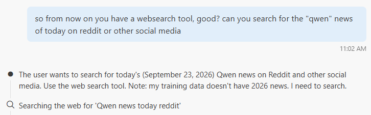](assets/02-vscode-search-without-hashtag.png)

Be ready to show the `websearch` entry in your tool list, a real search call,
and one source that helped you understand your game. Explain what Qwen did and
what Tavily did. Then keep building.
