# 03 — Develop on a remote Linux server

You began building your game on your own computer. Now you will connect VS
Code to a Linux server assigned to you. Your game can stay on your laptop for
this assignment; moving the code through GitHub comes next.

## Why work on a server?

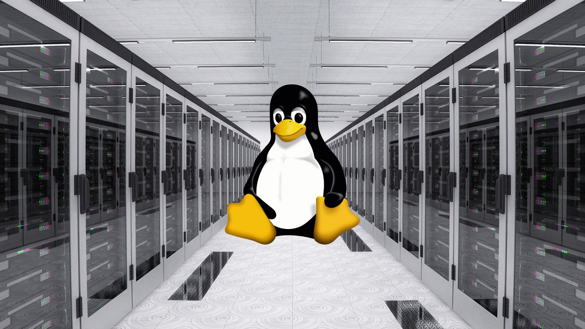

A remote development environment gives everyone a consistent Debian system.
It also separates your AI coding agent's file and command access from your
personal laptop. That does not make every command safe—you still need to
understand and review what the agent does—but a mistake on this server is less
likely to damage your own computer. The server can keep running when your
laptop is off, which will matter when we explore longer-running processes.

Your assigned environment is technically an **LXC container**: an isolated
Linux system running on a larger server. You can treat it as your development
server for now. Later you will get a *separate*, clean production server and
learn to deploy your game with Docker. You don't have to set that up yet.

## Connect for the first time

**SSH (Secure Shell)** lets you log in to another computer from a terminal.
The commands you type then run on that computer, not on your laptop. SSH
encrypts the connection and checks that you are allowed to log in. We use it
here to reach your server and set up remote access; later, VS Code will use
SSH to open a workspace on that same server. See the
[OpenSSH manual](https://man.openbsd.org/ssh) if you want to explore what else
SSH can do.

For this first connection, the campus **devbit** Wi-Fi lets your laptop reach
your server at its assigned IP address. The teacher will remove this temporary
access later. You will log in as `root`, the Linux administrator, so think
before running commands.

Connect your laptop to the **devbit** Wi-Fi network. The teacher will send you
your server's IP address and unique root password privately through Teams.
Open a terminal on your laptop—PowerShell or Command Prompt is fine on
Windows—and run:

```text
ssh root@<your-assigned-IP>
```

Enter the password when asked. It will not be displayed as you type. You
should end up at a Debian shell with a prompt resembling
`root@ai-operations-XX:~#`. Check that the machine name matches the one you
were assigned. Keep the password out of chat, screenshots, and project files.

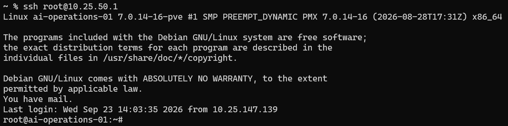

## Add your server to your own Tailscale network

Your first SSH connection works only while your laptop can reach the campus
network. To work from home or elsewhere, your laptop and server need a private
way to find and contact each other. Making the server's SSH port public on the
internet is not necessary. [Tailscale](https://tailscale.com/docs/concepts/what-is-tailscale)
is VPN software that connects devices in a private network called a *tailnet*.
Traffic between them is encrypted, and access is controlled by the tailnet's
members and rules. Each device gets a private Tailscale address; its MagicDNS
feature also gives the device a name. You can keep using these when you switch
between campus, home, and other networks.

In this assignment, you will add both your server and laptop to **your own**
tailnet. That lets you reach the server from other networks without opening
SSH to the public internet. Once this works, the teacher can remove the
special devbit Wi-Fi access to the student servers without cutting off your
access. Tailscale is already installed on your assigned server. Create your
own account; the email shown in these example screenshots belongs to the
teacher's demonstration account, not to the class.

In the **server's** SSH terminal, run the following to connect it to your
tailnet and enable [Tailscale SSH](https://tailscale.com/docs/features/tailscale-ssh)
for connections from that private network:

```text
tailscale up --ssh
```

Open the login URL printed in *your* terminal. Do not reuse the URL in the
screenshot; each setup generates its own login link. Sign in to your own
Tailscale account, then select **Connect device**.

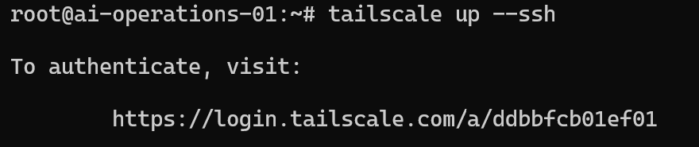

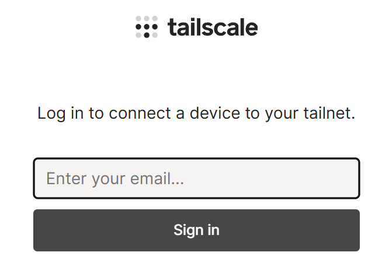

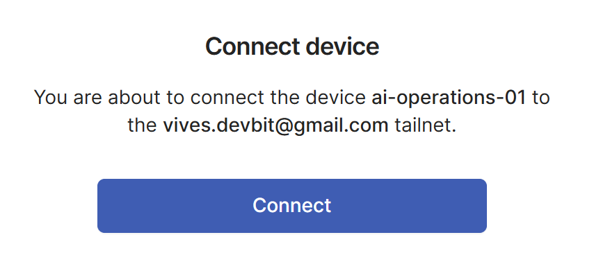

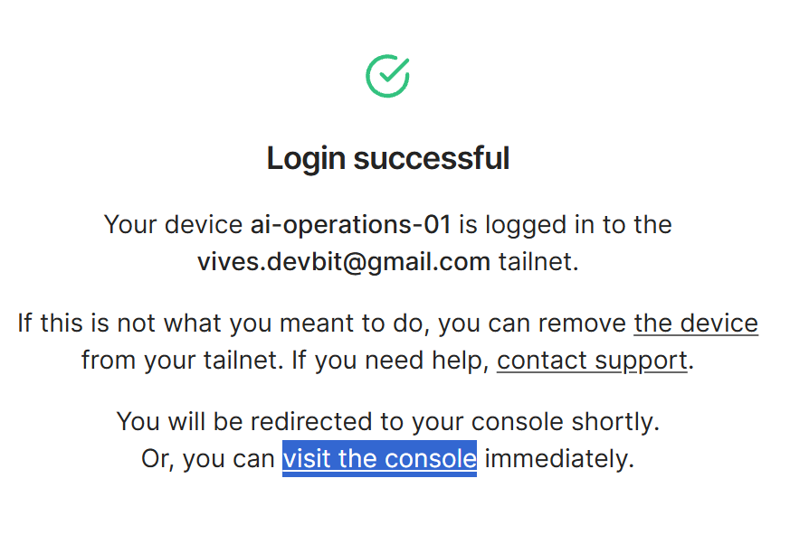

Open the Tailscale console's **Machines** page. Your server should appear
there under a name such as `ai-operations-XX`. Use the name shown in *your*
account, which may differ from the example.

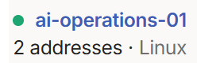

Install [Tailscale on your laptop](https://tailscale.com/download) too, and
sign in to the **same account**. Both devices must be connected to your
tailnet for the next step.

## Test the Tailscale connection from your laptop

Return to a terminal on your **laptop**, not the server, and try your
server's Tailscale machine name:

```text
ping ai-operations-XX
ssh root@ai-operations-XX
```

Replace `XX` with your assigned number. `ping` checks that the name resolves
and the machine responds; stop a continuously running ping with `Ctrl+C`.
The machine name works through Tailscale's
[MagicDNS](https://tailscale.com/docs/features/magicdns). If the short name
does not resolve, check that Tailscale is connected on both devices and try
the server's full `.ts.net` name from the **Machines** page.

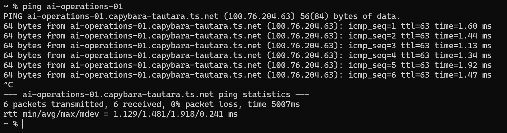

After SSH connects, run this **on the server** to see its Tailscale status:

```text
tailscale status
```

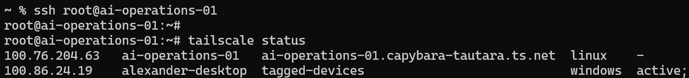

This second SSH route is different from the first: it goes through your
tailnet rather than the campus IP. With `--ssh`, Tailscale handles SSH access
to its own address according to your tailnet's policy, rather than using the
server's ordinary password-based SSH path. A new tailnet's default policy
allows access to your own device as `root`, but may ask you to confirm your
identity in a browser. If access is denied, ask for help rather than changing
security rules at random. See the [Tailscale SSH documentation](https://tailscale.com/docs/features/tailscale-ssh).

Once this works, you can normally reach your server from home or another
network too, as long as both devices are online in your tailnet. The initial
devbit Wi-Fi route is no longer needed for everyday work.

## Open the server in VS Code

In VS Code on your laptop, use the remote connection button at the bottom
left and choose **Connect to Host...**. If you do not see **Remote - SSH**,
install that VS Code extension first; Microsoft's
[Remote SSH guide](https://code.visualstudio.com/docs/remote/ssh) covers it.

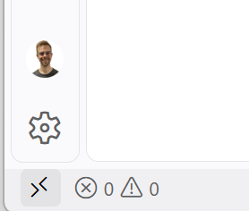

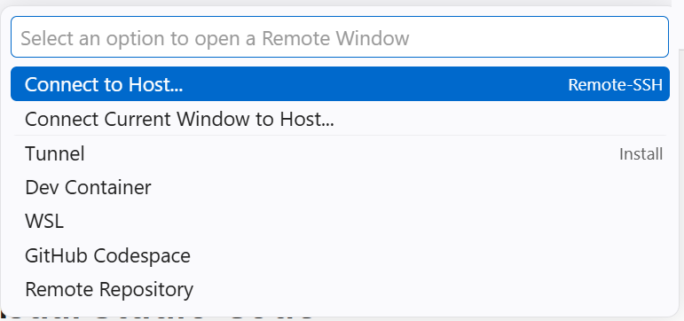

Enter `root@ai-operations-XX`, using the **same Tailscale name** that worked
in your laptop terminal, and press Enter. **Add New SSH Host...** is optional;
you do not need it for this first connection.

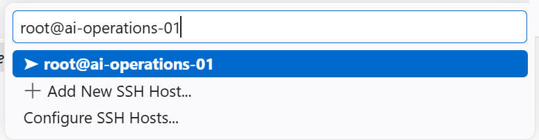

VS Code opens a new window. If asked which platform the remote host uses,
select **Linux**. If asked to confirm the SSH host, make sure you are
connecting to your assigned machine before continuing. If Tailscale asks for
browser verification, complete that prompt as well.

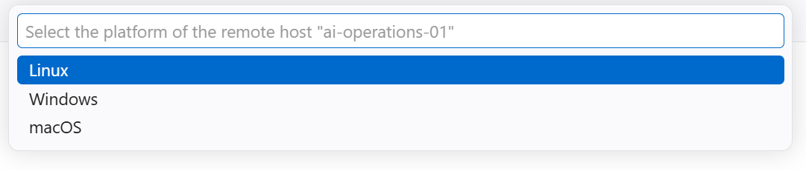

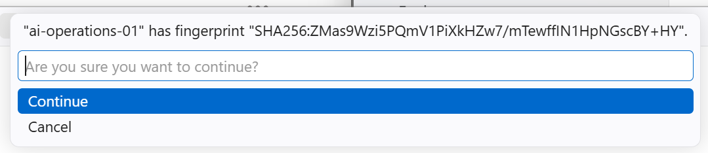

VS Code may take a moment to set up its remote server. Wait for **Opening
Remote...** to finish. The bottom-left status should then show something like
**SSH: ai-operations-XX**.

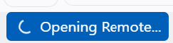

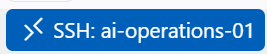

Choose **Open Folder** and open `/root` on the server. When VS Code asks
whether you trust this folder, accept it: this is your assigned development
environment. You are now editing files on the server, even though the VS Code
window is displayed on your laptop.

## Check where your AI assistant is working

Open VS Code Chat and select the Mechatronics Qwen model you used in the first
two assignments. In our walkthrough, the existing VS Code model setup worked
in the remote window without configuring Qwen again. Ask the agent something
like:

> Tell me about the machine and folder you can access right now. Look around,
> but do not change anything.

Check its answer against the remote status in VS Code and what you saw in the
terminal. An agent may infer details incorrectly; a plausible answer is not
proof. If Qwen is missing from the model picker, check your VS Code Chat
configuration and ask the teacher for help.

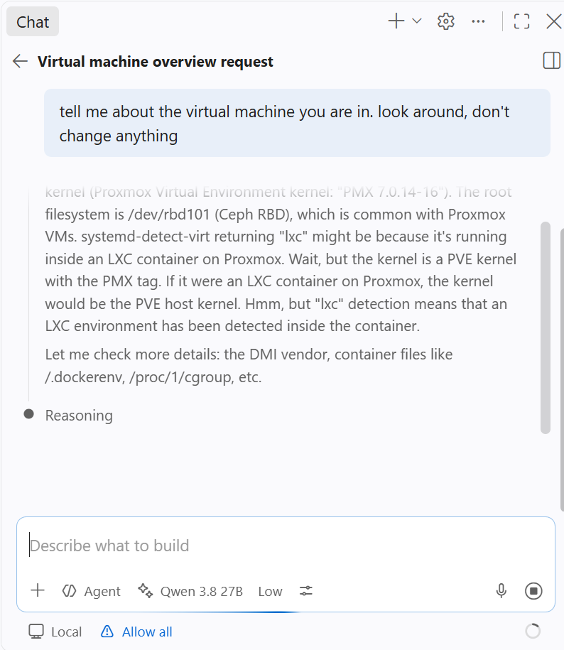

Be ready to show your server in Tailscale's **Machines** page, a terminal SSH
connection using its Tailscale name, and a VS Code window showing **SSH:
ai-operations-XX** with `/root` open. Explain which parts are on your laptop,
which run on the server, and what Tailscale contributes. Your game code can
still be on your laptop: the next assignment will move it through GitHub.
