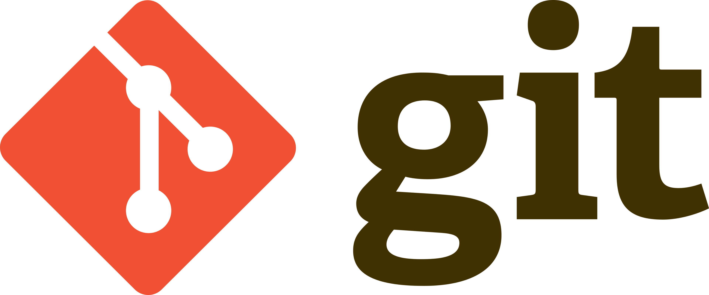
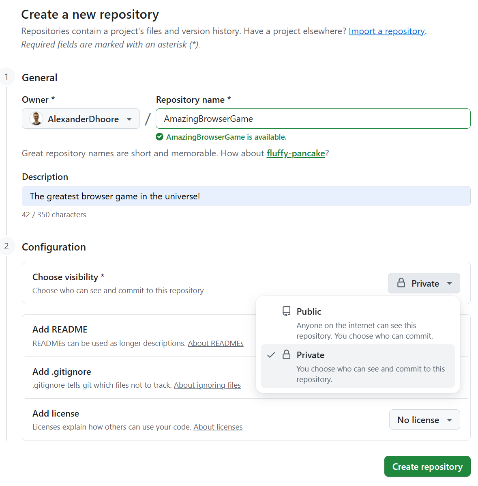
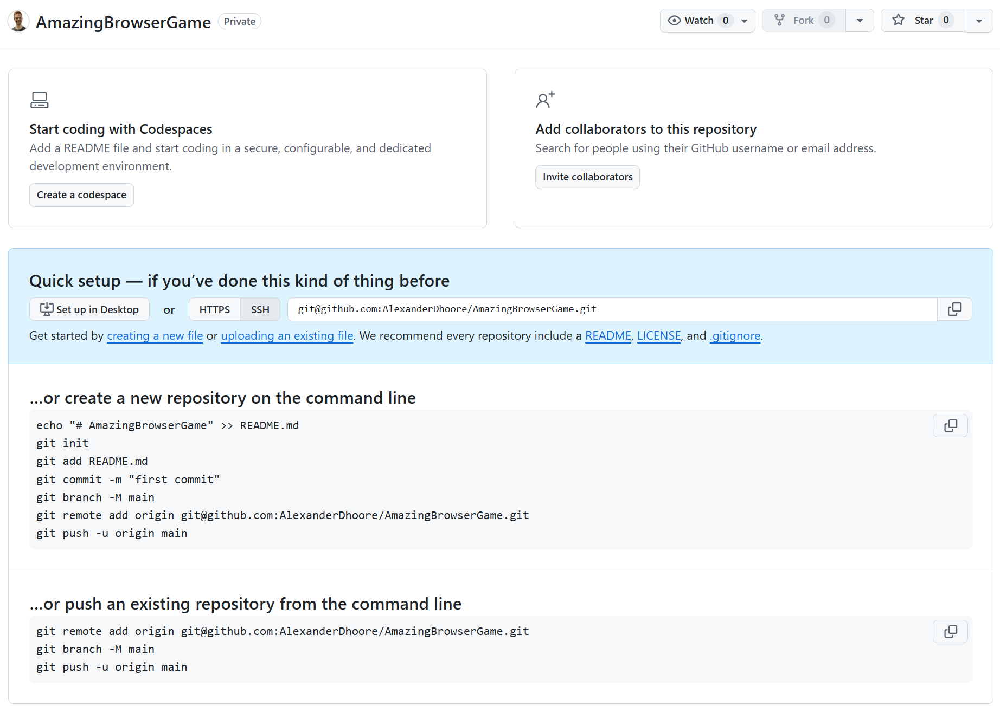
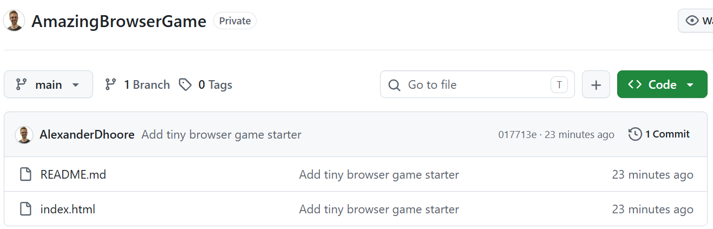
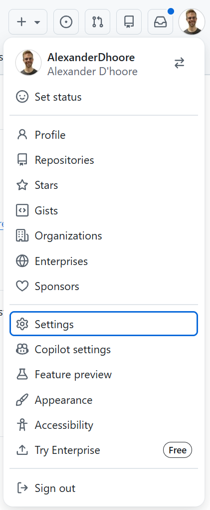
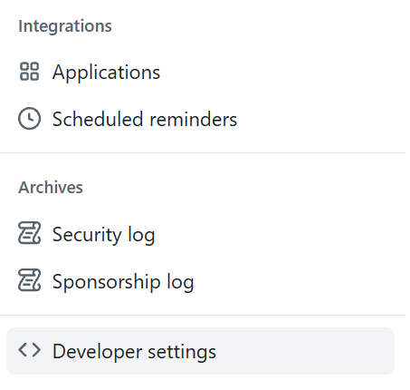
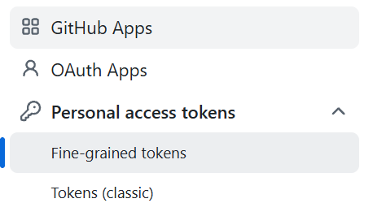
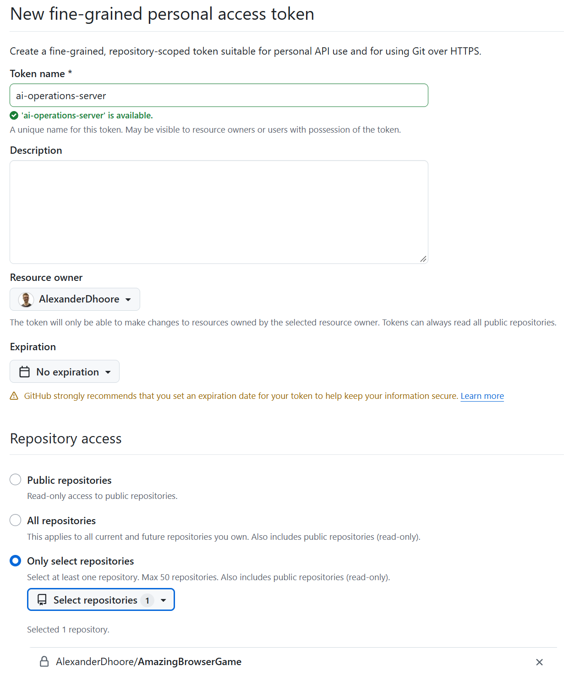
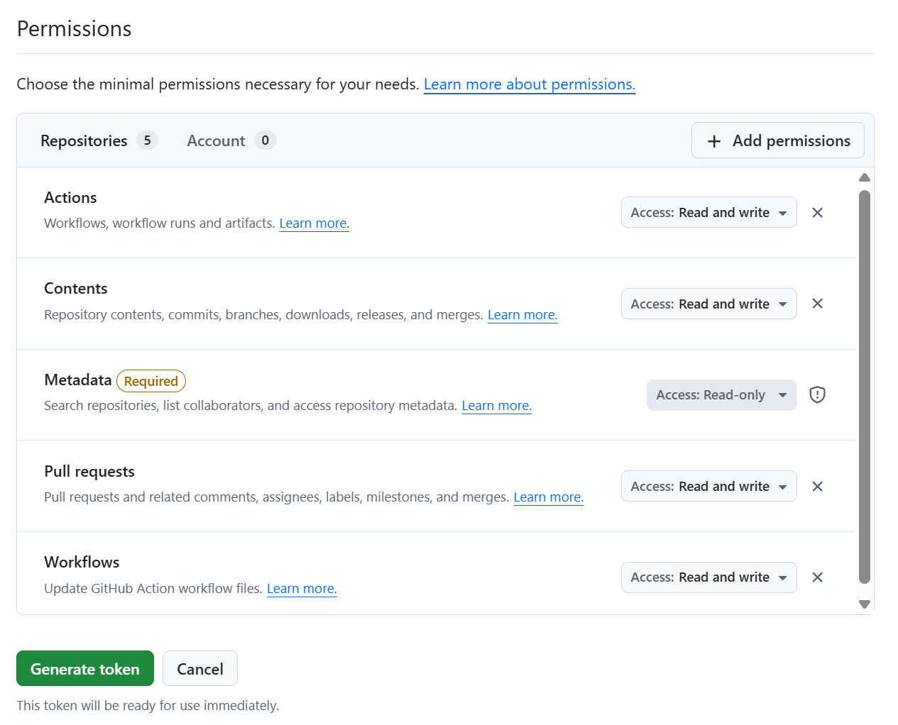
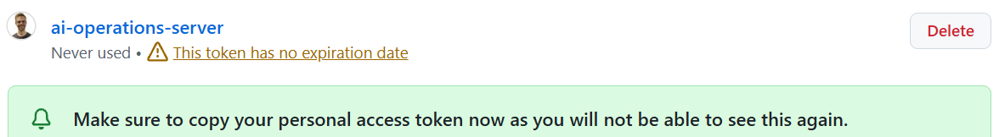

# 04 — Put your game on GitHub



Your game started on your laptop. In Assignment 03, you prepared a Linux server
and opened it through VS Code Remote SSH. Now you will use Git and GitHub to
move the game between those two development environments. By the end, your
Qwen agent will make a small change on the server, commit it, and push it to
GitHub.

## What are Git and GitHub doing here?

**Git** records versions of your project. A *commit* is a snapshot with a
message explaining a change. Your laptop and server can each have their own
*clone*: a complete working copy of the repository. **GitHub** hosts a remote
copy that they can both reach. You *push* commits to GitHub and *pull* commits
from it. This is more than copying files: the history tells you what changed
and gives you a way to move work between machines.

Your assistant can edit files and run Git commands, but you are responsible
for deciding what belongs in the repository and reviewing what it pushes.
Even a private repository is not a place for passwords, API keys, or access
tokens.

## Create an empty repository on GitHub

On your **laptop**, sign in to your own GitHub account and create a new
repository for your game. Give it a name you recognize, choose **Private**, and
leave **Add README**, **Add .gitignore**, and **Add license** unselected. You
will add your existing game files from your laptop in the next step. After
selecting **Create repository**, GitHub shows an empty repository with a
**Quick setup** section.

<a href="assets/04-create-private-repository.png"></a>

If your game is *already* in a GitHub repository under your account, use that
repository instead. Do not create a second one just for this assignment.

## Put your game on GitHub from your laptop

If your game is already on GitHub, check that its latest code is there and
continue to the next section. If your game already has a `.git` directory,
keep using that local repository rather than making a second clone. Follow
GitHub's
[instructions for pushing an existing repository](https://docs.github.com/en/migrations/importing-source-code/using-the-command-line-to-import-source-code/adding-locally-hosted-code-to-github),
then check that your files appear on GitHub.

If your game is not yet tracked by Git, use the empty repository you just
created. On its **Quick setup** page, select **HTTPS** and copy the repository
URL. Open a terminal on your **laptop** and clone it, replacing the example
URL with your own:

<a href="assets/04-empty-private-repository.png"></a>

The example screenshot has **SSH** selected; switch to **HTTPS** for the URL
used below unless you have already set up GitHub SSH keys on your laptop.

```text
git clone https://github.com/YOUR-USERNAME/YOUR-REPOSITORY.git
cd YOUR-REPOSITORY
```

The new folder is your *local clone*. Copy your existing game's files into
it. Run the following Git commands from inside this folder.

Before the first commit, add a `.gitignore` appropriate for your game's
technology. It should exclude generated files and local configuration that
does not belong in source control. Check especially for credentials, `.env`
files, and dependency folders such as `node_modules`. Review the files Git
will include:

```text
git status
git add .
git diff --cached --stat
```

If you staged something private or unnecessary, remove it from the staging
area before continuing. When the staged files look right, make your first
commit and push it:

```text
git commit -m "Add the first version of my game"
git push -u origin main
```

If your branch has a different name, use that name instead of `main`. Refresh
the GitHub repository page. You should see your game files and your commit.

<a href="assets/04-private-repository-file-list.png"></a>

## Give the server access to this repository—not your whole account

The server needs to clone and push your game, and your agent needs to do the
same work from the remote VS Code window. Logging the server into your entire
GitHub account would give it access to much more than this game. Instead,
create a **fine-grained personal access token** limited to this one
repository. The token is a credential: anyone who can use it can perform the
actions you allow. Restricting its repository and permissions limits what a
mistake or a compromised server can affect; it does not make the token secret
from an agent that can run commands as you on that server.

On GitHub, open your profile menu and choose **Settings**.

<a href="assets/04-github-profile-settings.png"></a>

In the settings sidebar, open **Developer settings → Personal access tokens →
Fine-grained tokens**, then choose **Generate new token**.

<p>
  <a href="assets/04-github-developer-settings.png"></a>
  <a href="assets/04-github-fine-grained-tokens.png"></a>
</p>

Give the token a name such as `ai-operations-server`, select your own account
as the **Resource owner**, and choose **No expiration** or an expiration date
you prefer. Set **Repository access** to **Only select repositories** and
select *only your game repository*.

<a href="assets/04-token-repository-access.png"></a>

Under **Repository permissions**, set:

- **Contents: Read and write** — clone and push code; later, merge pull
  requests.
- **Pull requests: Read and write** — create and manage pull requests later.
- **Actions: Read and write** — inspect and trigger GitHub Actions runs later.
- **Workflows: Read and write** — add or change workflow files later.

<a href="assets/04-token-permissions.png"></a>

GitHub adds **Metadata: Read-only** automatically. We are preparing for later
pull-request and CI/CD assignments, but this assignment does not ask you to
create a pull request or a workflow. Do not grant access to other repositories
or turn on extra permissions just in case. GitHub documents the
[token creation process](https://docs.github.com/en/authentication/keeping-your-account-and-data-secure/managing-your-personal-access-tokens)
and the [permissions needed by API operations](https://docs.github.com/en/rest/authentication/permissions-required-for-fine-grained-personal-access-tokens).

Generate the token and copy it when GitHub shows it. It will not show you the
value again. Keep it out of chat, screenshots, your game files, and your Git
history. If you expose it, revoke it and create a new one. You will enter the
new token in the server's terminal in the next step.

<a href="assets/04-token-copy-reminder.png"></a>

## Authenticate GitHub on your Linux server

In your **Remote SSH** VS Code window, open a terminal. The terminal should
be on your assigned Linux server, not on your laptop. Check that Git and
GitHub CLI (`gh`) are available:

```text
git --version
gh --version
```

Enter your token without putting its value in the command or shell history:

```bash
read -rsp 'GitHub token: ' aiops_pat; echo
printf '%s\n' "$aiops_pat" | gh auth login --hostname github.com --git-protocol https --with-token
unset aiops_pat
gh auth setup-git
gh auth status
```

The hidden input does not show your token as you paste it. GitHub CLI keeps
the credential on the server so Git and your agent can use it later. Do not
run `gh auth status --show-token` or paste the token into an agent prompt.
GitHub CLI notes that fine-grained tokens can behave unexpectedly with
commands that try to inspect your *whole account*; here we will test access
to the selected repository directly. See the
[GitHub CLI authentication guide](https://cli.github.com/manual/gh_auth_login).

## Clone the game on the server

Still in the **server's** terminal, clone the same repository into `/root`:

```text
cd /root
gh repo clone https://github.com/YOUR-USERNAME/YOUR-REPOSITORY.git
cd YOUR-REPOSITORY
git status
git log -1 --oneline
```

You should see the commit you pushed from your laptop. In the Remote SSH VS
Code window, choose **Open Folder** and open `/root/YOUR-REPOSITORY`. Your
agent's file and terminal tools now work in the server's copy of your game.

Before you ask the agent to commit, check the author identity Git will use on
the server:

```text
git config user.name
git config user.email
```

If either is missing, set your own name and an email associated with your
GitHub account (or your GitHub no-reply address) using `git config --global
user.name "YOUR NAME"` and `git config --global user.email "YOUR EMAIL"`.
This name and email label your commits; the token controls permission to push
them. They are different settings.

## Let Qwen make and push a change

Open VS Code Chat in this remote window and select the Mechatronics Qwen
model. Give the agent one small, visible improvement to make in your game.
For example:

> In this repository, improve one small part of my browser game. Run any
> relevant checks, then show me which files changed and explain the change.
> Do not commit or push yet.

Inspect the change and try the game or relevant tests. Ask questions if you
do not understand what changed. When you are satisfied, tell the agent:

> Commit the changes with a clear message and push the commit to `origin`.

Refresh GitHub and find the new commit. The commit was made on the **server**,
then pushed to GitHub; it has not automatically appeared in the game folder
on your laptop. Before you edit the laptop copy again, pull the new commit
there with `git pull`.

## Be ready to show

Show your private GitHub repository with your game files, the commit you
pushed from the laptop, and the new commit Qwen pushed from the server. Be
able to explain what a clone, commit, push, and pull are, why the server uses
a token restricted to one repository, and which copy of the game the agent
changed. We will use pull requests and GitHub Actions in later assignments.
