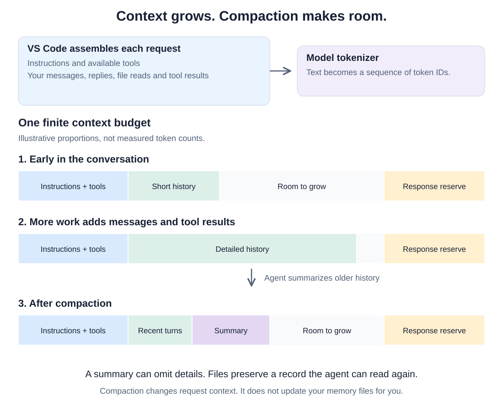
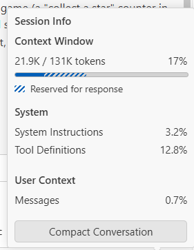
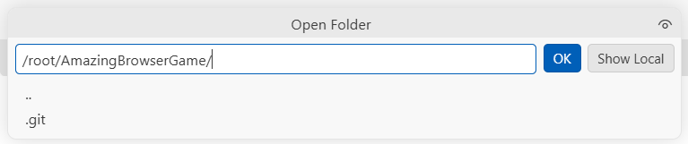
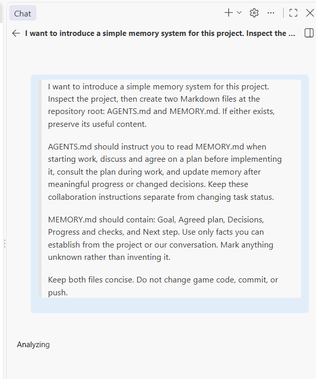
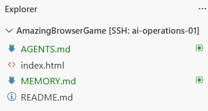
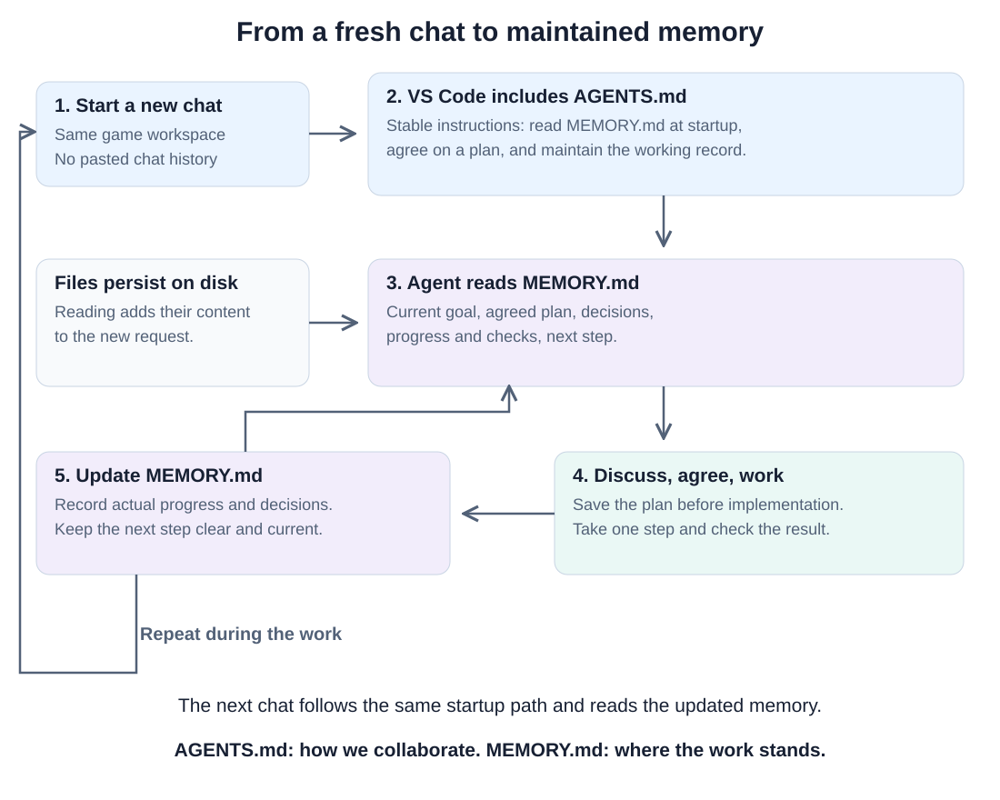
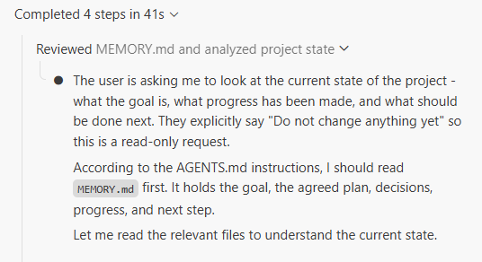
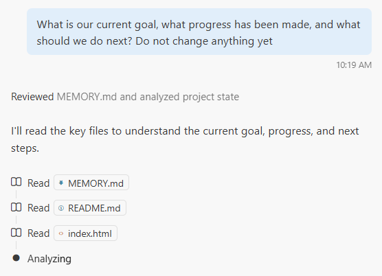

# 05 — Give your agent a memory

Your coding agent has helped you build a game, work on a Linux server, and
use GitHub. But a long conversation is a fragile place to keep your project's
plan. In this assignment, you will give the agent a small memory system:
two Markdown files in your game repository, kept useful as the work changes.
You will finish by opening a new chat and checking whether it can pick up
where you left off.

## What fits in context?

A language model processes **tokens**, not a simple count of words or letters.
A tokenizer turns text into a sequence of units represented by numbers. A unit
might correspond to a whole word, part of a word, punctuation, or whitespace.
Code is tokenized too: variable names, operators and indentation all contribute.

Think of a long word being split into several pieces. The exact boundaries
are determined by the tokenizer, not by where you would split the word when
reading it. GPT, Claude and Qwen models do not necessarily use the same
tokenizer. The same sentence or program can therefore have different token
counts with different models. You do not need to calculate these counts by
hand. The important point is that word count and token count are different
measurements.

The **context window** is the bounded amount of information a model can work
with in one request. Your latest message is only part of it. Instructions,
available tool definitions, earlier exchanges, selected file contents and tool
results also take space. Customizations can contribute instructions too. We
will discuss skills in a later assignment.

Each time the agent asks the model what to do next, it assembles the relevant
context again. A terminal command with a long output or a large file read can
add much more than a short chat message. The whole repository does not become
known to the model merely because you opened its folder.



Open the context indicator in your VS Code Chat session and inspect the
**Session Info** popup. In our walkthrough it showed **21.9K / 131K tokens**,
with space used by system instructions, tool definitions and messages, plus
space reserved for the response:



Notice how much space the tool definitions use even before there is a long
conversation. Your usage will differ. Our course configuration divides the
budget into **96K tokens for input and 32K reserved for output**:

```text
 98,304 input tokens  (96 × 1,024)
+32,768 output tokens (32 × 1,024)
────────────────────────────────
131,072 tokens total (128 × 1,024)
```

VS Code displays that total as approximately **131K**. This is the same
budget, not 131K available for the conversation alone. Instructions, tool
definitions, chat history and retrieved content share the input allowance.
The output reservation is a maximum, not a requirement to produce a response
that long.

The [Mechatronics LLM guide](https://docs.mechatronics.be/llm/) configures
`contextWindow: 131072` and `maxOutputTokens: 32768` for VS Code. This is our
course setup, not a universal limit for every Qwen deployment. Agent software
may leave additional headroom or compact before the input budget is full.

## What happens when the conversation grows?

As context fills, VS Code can **compact** older conversation history by
summarizing it. You can think of this as replacing detailed meeting notes with
a shorter handoff. There is room to continue, but some of the original detail
may no longer be present in the next request. The visible chat history and
what the model receives are not necessarily identical.

A summary can preserve the main goal while losing why you rejected a library,
which edge case still fails, or whether a proposed feature was ever approved.
Repeated summaries can compound that loss. A larger window gives you more
room, but it is not a guarantee that every earlier detail will be used correctly.

Compaction is managed by the agent software. A model server reaching its
limit does not, by itself, guarantee that a useful summary will be created.
Our popup includes **Compact Conversation**, and VS Code also documents
manual compaction with `/compact`. You do not need to fill the window or
force compaction for this assignment. See
[VS Code's context explanation](https://code.visualstudio.com/docs/agents/concepts/context#context-window-and-compaction)
for the current behavior.

## Keep useful information outside the chat

For this assignment, **memory** means ordinary files that survive the chat.
Writing a decision down gives the next conversation something concrete to
read. It does not train the model or make the file magically available. The
agent must retrieve it, and the retrieved text still takes space in context.

Some memory systems use databases such as SQLite or store relationships in
knowledge graphs. Our system will stay small enough to read, review and track
with Git. Use this same layout at the root of your game repository:

```text
YOUR-GAME/
├── AGENTS.md
├── MEMORY.md
└── ...your existing game files
```

`MEMORY.md` is the **changing working record**. It holds the goal, agreed plan,
important decisions, progress and checks, and the next step. Update it when
work changes. Replace stale statements rather than appending every exchange.
Record what actually happened, including what remains untested.

`AGENTS.md` holds the **stable collaboration instructions**. It tells the agent
where memory lives, when to read it, and how to maintain it. Stable does not
mean immutable, but finishing a task should normally change `MEMORY.md`, not
the collaboration rules. Keeping the two separate makes both easier to review.

Keep secrets out of both files, even in a private repository. Write useful
project facts and decisions, not passwords, API keys or a transcript of chat.

## Create the two files in your game repository

Connect VS Code to your assigned server as in Assignment 03. Open your game's
repository folder itself, rather than its parent `/root`. The screenshot uses
the teacher's game folder. Use your own:



Select your Mechatronics Qwen model in **Agent** mode. Ask:

> I want to introduce a simple memory system for this project. Inspect the
> project, then create two Markdown files at the repository root: AGENTS.md
> and MEMORY.md. If either exists, preserve its useful content.
>
> AGENTS.md should instruct you to read MEMORY.md when starting work, discuss
> and agree on a plan before implementing it, consult the plan during work,
> and update memory after meaningful progress or changed decisions. Keep
> these collaboration instructions separate from changing task status.
>
> MEMORY.md should contain: Goal, Agreed plan, Decisions, Progress and checks,
> and Next step. Use only facts you can establish from the project or our
> conversation. Mark anything unknown rather than inventing it.
>
> Keep both files concise. Do not change game code, commit, or push.

<details>
<summary>Our setup prompt in VS Code</summary>



</details>

Open both files after the agent creates them. Do not stop at its claim that
the files exist. Check the contents against your project and correct invented
plans, assumptions or claims that tests have passed.



A minimal `AGENTS.md` can look like this. Adapt any existing instructions
rather than replacing them blindly:

```markdown
# Working on this game

- At the start of work, read MEMORY.md in this repository.
- Discuss the goal and agree on a plan with me before implementing it.
- Save the agreed plan in MEMORY.md and consult it during the work.
- After meaningful progress or changed decisions, update MEMORY.md.
- Record checks actually performed, their results, and what remains untested.
- Keep memory concise and current. Replace outdated information.
- Keep task progress in MEMORY.md, separate from these collaboration rules.
- Never put passwords, API keys or access tokens in either file.
- Ask before committing or pushing changes.
```

Use these headings for `MEMORY.md`, with short, factual entries:

```markdown
# Project memory

## Goal
What we are trying to achieve now.

## Agreed plan
Small steps that the student has approved.

## Decisions
Important choices and the reasons for them.

## Progress and checks
Completed work, actual check results, and remaining uncertainties.

## Next step
The next action, or the decision we still need to make.
```

These descriptions are guidance for filling the file, not a completed memory.
If no plan has been agreed yet, say so.

## Use memory while doing real work

Choose one small improvement to your game, such as explaining its controls
more clearly or adding a restart action. Keep it small enough to try yourself.
Begin with discussion:

> I want to improve [describe one small part of the game]. Inspect what is
> relevant and propose a short plan. Discuss the choices with me before
> changing code.

Once you agree, ask the agent to write the goal, plan and decisions into
`MEMORY.md`. Read the saved plan yourself. Then ask:

> Carry out the first agreed step. Refer to MEMORY.md as you work. Run the
> relevant checks, then update memory with what changed, what was checked,
> and what remains to do. Do not commit or push yet.

Inspect the code changes and try the affected behavior. A claim in memory is
not evidence that the game works. If you find a problem, tell the agent and
make sure memory reflects the problem rather than marking the step complete.
Continue through the plan in manageable steps.

Before ending the conversation, ask it to reconcile `MEMORY.md` with the
actual state. There should be a clear next step, or an explicit statement
that the agreed work is complete. Memory maintenance is part of the task,
not something you only do once the context window is already full.

## How does a new chat find the memory?

The filename **`AGENTS.md`** has a special role in compatible coding agents.
VS Code supports a root-level file as project instructions. Use that exact
uppercase, plural name on Linux. `MEMORY.md` is our own convention. It becomes
useful because the instructions tell the agent to read and maintain it.

For VS Code's Local agent, support is controlled by `chat.useAgentsMdFile`.
If discovery fails, search for that setting in Settings and check that it is
enabled. Other agent types have their own discovery rules. See
[VS Code's instructions documentation](https://code.visualstudio.com/docs/agent-customization/custom-instructions#use-an-agentsmd-file).



The important distinction is between the editor supplying instructions and
the agent retrieving the working record. An instruction to read a file is
not proof that the read happened. Check the tool activity and the resulting
answer. Instructions also do not grant new system permissions or enforce
rules as a security boundary.

## Test the handoff with a fresh chat

Save both files. Use the **+** button at the top of the Chat view to open
**New Chat** in the same VS Code workspace. Keep **Agent** mode and the same
Qwen model selected. Do not paste the old conversation, restate the plan,
or manually attach `AGENTS.md` or `MEMORY.md`. Ask:

> What is our current goal, what progress has been made, and what should we
> do next? Do not change anything yet.

Compare the answer with `MEMORY.md`. Look for a read of the memory file or a
reference showing that its content was included. If your VS Code response
has a **References** section, expand it and check for the project instructions.
An accurate guess about the game from its source code is not enough to show
that the agreed plan was recovered.

In our fresh-chat walkthrough, the agent referred to the instruction in
`AGENTS.md` to read memory first:

<details>
<summary>Our agent identifies the project instruction in the new chat</summary>



</details>

The visible tool activity then shows it reading `MEMORY.md`, followed by the
project README and game source:



That is the behavior to look for: retrieving the saved record and checking
the project. Still compare the final answer with the file. Reading memory
alone does not prove that every conclusion in the answer is correct.

If it misses the memory, first check that the two files are saved at the
workspace root and that `AGENTS.md` clearly directs the agent to read
`MEMORY.md`. Check instructions-file support, then retry in another new chat.
If memory is read but gives the wrong next step, correct the memory itself.
Do not solve the demonstration merely by pasting the missing plan into chat.

A fresh chat is a test of recovery from files. It is not evidence that a
compaction occurred. Both situations benefit from a clear external record.

## Be ready to show

Show your two files, a saved plan for a real game improvement, and how memory
changed after you completed and checked a step. Then show a fresh chat
recovering the current goal and next step. Explain what a token is, what
compaction can lose, and why `AGENTS.md` and `MEMORY.md` have different roles.

Review the final diff, including the memory files, before committing. Commit
and push your reviewed work using the workflow from Assignment 04. These
files belong with the project so their changes can be inspected in Git.
