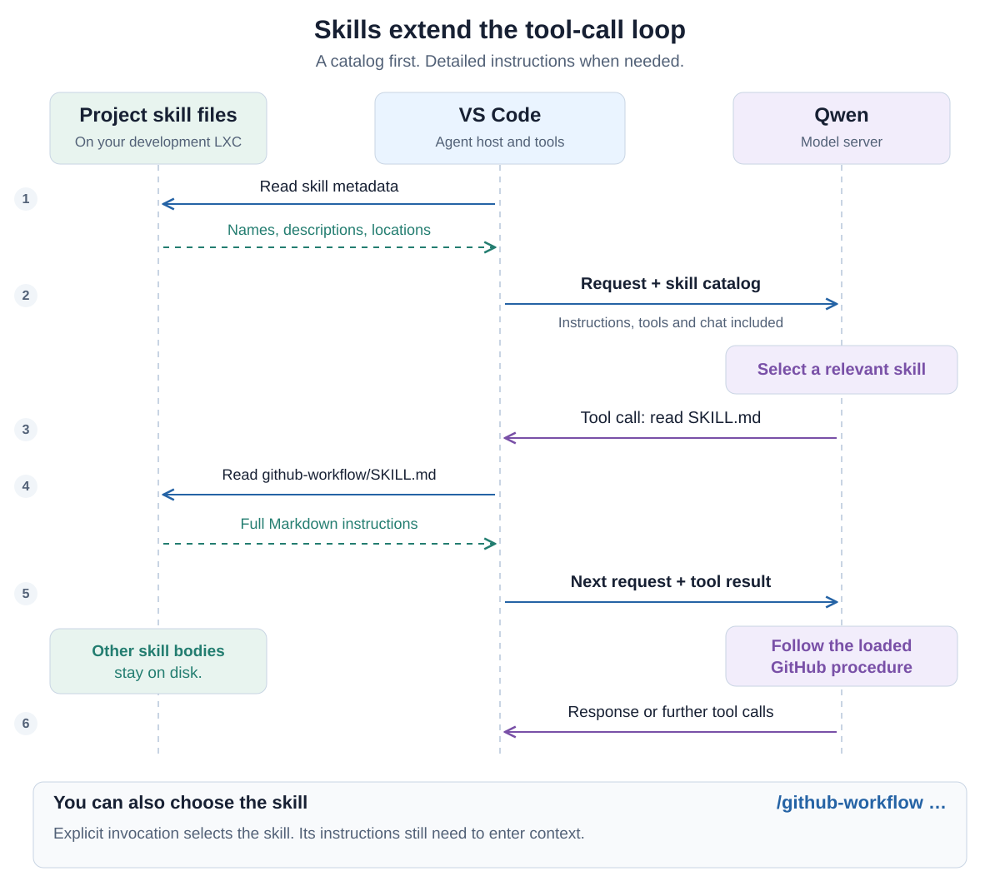
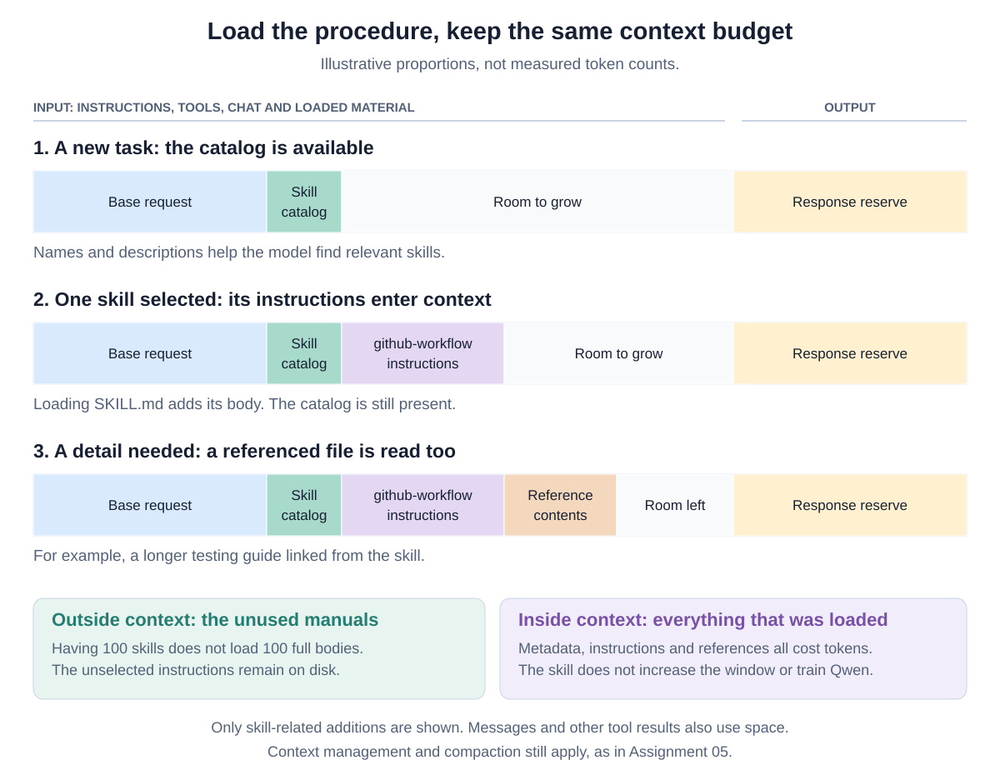
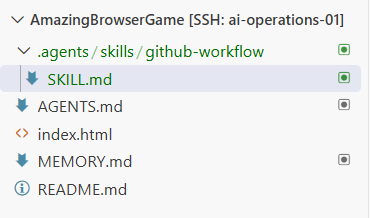
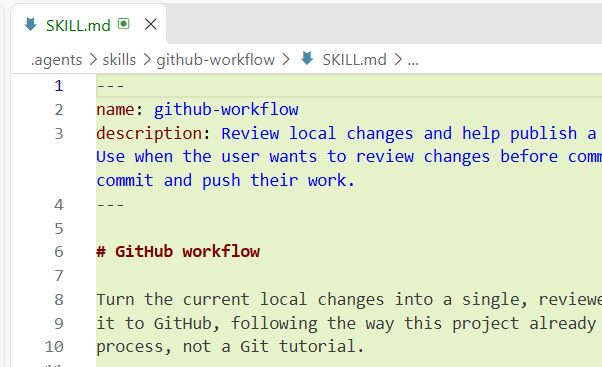
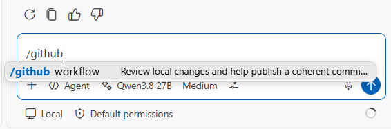
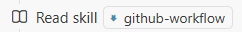

# 06 — Teach your agent a skill

In [Assignment 05](05-give-your-agent-a-memory.md), you gave your agent
instructions and a working memory. Now you will give it a reusable procedure:
how you want to review changes, make a commit and push your work to GitHub.
You will build the skill with your agent, try loading it yourself, and see
whether the agent chooses it when relevant. Then create a skill for your game.

## Start with a familiar task

Open your game repository in VS Code Remote SSH, select Qwen in **Agent**
mode, and start a new chat. Before creating the skill, ask:

> I want to put my next game changes on GitHub. Inspect the current Git state
> and explain how you would review, check, commit and push the changes.
> Do not change files, stage, commit or push yet.

Discuss the answer. Does it describe the way you want to work? What should it
check, and when should it involve you? If the working tree is clean, discuss
the procedure for your next change. There is no need to invent work to commit.

Qwen may already give a good answer. The point is to capture **your agreed
way of working** so it is available in future chats. In
[Assignment 04](04-put-your-game-on-github.md), you reviewed an AI-generated
change before asking for a commit and push. We will turn that workflow into
a skill, without adding a new branch strategy or pull-request process yet.

## What is a skill?

A skill packages knowledge and instructions for a recurring kind of task.
It can describe a procedure, give examples, point to detailed documentation,
or include scripts. Its core is a directory containing `SKILL.md`.

For our GitHub skill, the goal is concrete:

> Turn local project changes into a clear, reviewed commit and push it to
> GitHub when requested.

The skill describes how to approach that task. It does not teach the model
Git from scratch or give it a new GitHub account. The agent uses the tools
and repository access you already set up.

The files now have complementary roles:

| File | What it tells the agent |
| --- | --- |
| `AGENTS.md` | How we collaborate in this project, including how to use memory. |
| `MEMORY.md` | Where our current work stands, its decisions and next step. |
| `SKILL.md` | How to carry out a particular recurring task when it comes up. |

Keep today's changed filenames and temporary progress in memory or Git state.
Keep the reusable procedure in the skill. You do not need to paste that
procedure into `AGENTS.md` as well.

## Available first, loaded when needed

Imagine having 100 skills. Sending all 100 full instruction files with every
new chat would use context on procedures you might never need. Instead, the
agent host can advertise a compact **catalog**: each available skill's name,
description and, where needed, location.

The model uses that catalog to identify a relevant skill. It can then request
the full `SKILL.md`. Supporting files are retrieved later if needed. This
staged loading is called **progressive disclosure**, or informally *lazy
loading*. The description is written as part of the skill, not necessarily
generated by summarizing its body. See the
[Agent Skills overview](https://agentskills.io/home).

Think back to [Assignment 02's tool-call diagram](02-add-web-search.md#what-is-an-agent-tool).
The same division of work applies here: Qwen requests an action and VS Code
performs it. VS Code is the **agent host**, also called the **coding harness**,
in this setup. With Remote SSH, the skill files live with the game on the
development server.



Follow the arrows: VS Code discovers the skill descriptions and includes the
catalog with the request. Qwen selects a skill and requests its contents.
VS Code reads the file and returns the instructions as context for the next
model call. The model can now follow the procedure and request further tools.
It does not directly open files on your server.

The diagram shows file-based loading. A harness may instead provide a
dedicated skill-activation tool, and the catalog can be placed in system
instructions or a tool description. There is no universal extra `skills`
field that every LLM API must support. These are harness implementation
choices. The [integration guide](https://agentskills.io/client-implementation/adding-skills-support)
explains both approaches.

## What happens to context?

Recall the [context diagram in Assignment 05](05-give-your-agent-a-memory.md#what-fits-in-context).
The window does not grow when you add skills. You choose what to put in it.



Initially, only the catalog takes space on behalf of those skills. Loading
one skill adds its detailed instructions. Reading a reference adds more.
The other skills' full contents stay on disk, outside the request.

This saves space compared with loading every manual at the start. It does
not make loaded information free: descriptions, instructions and tool results
all cost tokens. Skills can still be affected by context management and
compaction. The model is not being retrained, and a loaded skill does not
automatically disappear as soon as it is used.

Keep `SKILL.md` focused. If it grows, have your agent move detailed material
into referenced files. The [Agent Skills specification](https://agentskills.io/specification)
describes the metadata, instructions and supporting resources.

## Build the GitHub skill with your agent

Use this project location:

```text
YOUR-GAME/
├── .agents/
│   └── skills/
│       └── github-workflow/
│           └── SKILL.md
├── AGENTS.md
├── MEMORY.md
└── ...your existing game files
```

VS Code supports `.agents/skills/` as a project skill location. A skill starts
with YAML metadata between `---` lines, followed by Markdown instructions.
For this exercise, we need only `name` and `description`. The name matches
the containing directory. The description explains **what the skill does
and when to use it**. See [VS Code's skills guide](https://code.visualstudio.com/docs/agent-customization/agent-skills).

You do not need to write the file by hand. Discuss the workflow with your
agent, then ask it to create the skill. This is the same pattern as our memory
setup: use the agent to extend your AI working environment, and review what
it produces.

> I want to create a skill for a recurring task: **turning my local project
> changes into a clear, reviewed commit and pushing it to GitHub**.
>
> This skill should describe our way of working, rather than explain Git in
> general.
>
> Create `.agents/skills/github-workflow/SKILL.md` with this metadata:
>
> ```yaml
> ---
> name: github-workflow
> description: Review local changes and help publish a coherent commit to GitHub. Use when the user wants to review changes before committing, prepare a commit, or commit and push their work.
> ---
> ```
>
> Write concise instructions for this workflow:
>
> 1. Inspect the current branch and Git status, including untracked files.
> 2. Read the changes and explain what they do. Identify which changes belong
>    together. If the intended scope is unclear, discuss it with me.
> 3. Check whether credentials, local configuration, dependencies or generated
>    files would accidentally be included. Never print secret values.
> 4. Identify and run relevant existing checks when appropriate. Report what
>    passed, failed or remains untested. Discuss unresolved problems before
>    publishing.
> 5. Propose a clear commit message. Stage only the agreed files and review
>    the staged changes.
> 6. Commit and push when I explicitly request it. If I already requested
>    both, you do not need to ask again unless a new problem or ambiguity
>    appears.
> 7. Verify the result and briefly explain what was committed and whether
>    the push succeeded.
>
> Respect the project's existing AGENTS.md instructions. Leave unrelated work
> alone. Do not use force pushes or destructive Git commands. Use the existing
> GitHub setup, without introducing pull requests, CI or new credentials.
>
> Inspect the project to make the instructions accurate, but keep temporary
> details such as today's changed files out of the reusable skill.
>
> **For this request, only create or update the skill file. Do not stage,
> commit, push or change game code.** Preserve useful existing skill content
> and explain the result so we can review it together.

After creation, open the file. VS Code may display the nested directories
as one compact path, as it does in our walkthrough:



The beginning of the generated file shows its metadata and the start of
the procedure:



Read the complete file, not just the visible beginning. Does it capture what
you discussed? Would its description help the agent recognize a GitHub task?
Ask for revisions if it invents test commands or adds steps your project
does not use. This first skill needs no scripts or extra dependencies.

## Load the skill yourself

Save the file and open **New Chat** in the same game workspace, with Qwen in
Agent mode. Type `/` and look for `github-workflow` in the command picker.
Typing the start of its name filters the list:



Select it and add a task:

```text
/github-workflow Review my current changes and suggest a commit message.
Do not change files, stage, commit or push yet.
```

This is **explicit invocation**: you choose the procedure. Inspect any skill
loading indication or file-read activity and the resulting review. Compare
the actions with the skill instructions and the answer from your first chat.
Loading a skill gives guidance; you still need to check what the agent does.
The agent might identify the new skill file itself as an untracked change.

If it is missing from the picker, check the saved path and metadata. Open the
skills configuration with `/skills` to check discovery, then start a fresh
chat. Menu labels may vary with VS Code versions. The documented behavior
is described under [skills as slash commands](https://code.visualstudio.com/docs/agent-customization/agent-skills#use-skills-as-slash-commands).

Selecting a skill chooses guidance. Your request still determines whether
the agent should only review or should also commit and push. The skill does
not grant additional system permissions.

## Let the agent choose

Start another **new chat** so the previous explicit invocation does not
carry the loaded instructions into this demonstration. Do not attach the
skill file or mention its name. Ask:

> Review my current changes before I put them on GitHub. Explain which files
> belong in a commit, any issues you find, and a suitable commit message.
> Do not change files, stage, commit or push yet.

Now the skill's description should help the model recognize its relevance.
In our fresh-chat walkthrough, the agent chose `github-workflow` without us
naming it. VS Code showed the skill being read:



Look for this loading activity or instruction references in your own chat,
as well as the answer. A sensible Git review alone does not prove the skill
was used.

Automatic selection is not guaranteed. If it does not happen, discuss the
description with your agent. “Help with GitHub” is vague. “Review local
changes before committing or pushing” gives a much clearer trigger. Check
discovery, refine the description if useful, and try a fresh chat again.
Explicit invocation remains available when you want a particular workflow.

## Use it, then make it yours

When you are happy with the skill and its review, agree which files to publish
and ask the agent to commit and push them. The new skill is project content
and can be part of that commit. Check the result on GitHub as in Assignment
04. If the skill exposed a useful improvement to your workflow, discuss it
with the agent and have it update the instructions.

Then choose another recurring task in your own game and build one or more
skills around it. For example:

- **REST API:** how to add an endpoint using the game's existing request,
  response and error conventions, and how to check it.
- **Database:** how to work with the existing schema and test changes without
  damaging useful data.
- **Visuals or 3D:** how to add an asset or effect consistently and check it
  in the browser.
- **Game rules:** how to change gameplay while respecting valid moves,
  scoring and shared state.

Choose what exists and matters in your project. You do not need to add a
database or a 3D engine to justify a skill. Start by discussing the recurring
task and the desired outcome. Have the agent propose a description, write
the procedure and link relevant project documentation. Try it and refine it
together. Avoid copying the same rules into several competing files.
Ask the agent to give each additional skill its own folder at
`.agents/skills/<skill-name>/SKILL.md`, with a matching `name` in its metadata.

The `SKILL.md` format is shared across compatible agents, but discovery and
available tools vary. We will reuse this idea with Pi in the next assignment.

Before finishing, ask your agent to update `MEMORY.md` with what you learned
and what should happen next, then review the update together.

## Be ready to discuss

Be comfortable explaining what your GitHub skill adds, how you loaded it,
and what enters context when it is selected. Talk about what worked and
what you changed with your agent. The aim is a useful working method you
understand, not a collection of skills created just to increase the count.
