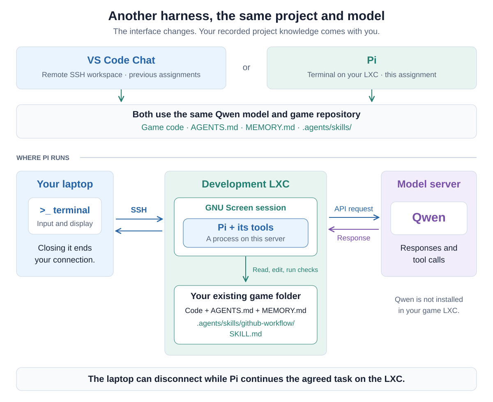
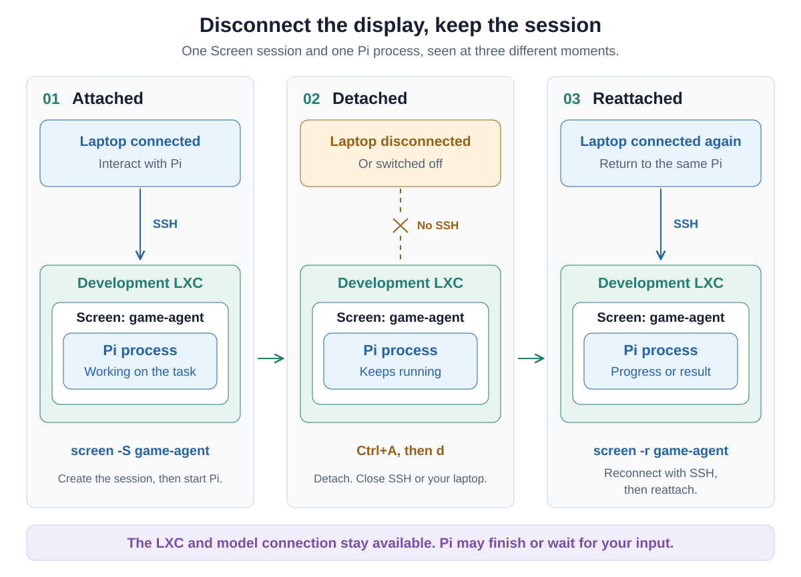

# 07 — Work with Pi in a persistent terminal

Your agent is working on a game improvement, but you want to close your
laptop. In this assignment, you will run **Pi**, a terminal coding agent,
inside **GNU Screen** on your development server. The server can keep
working on the task while you are disconnected. Later, you reconnect to the
same session and review the result.

You will keep the game, Qwen model, memory files and GitHub skill from the
previous assignments. Your VS Code agent will help prepare the new tools.
You will start Pi yourself and decide what work it should do.

## Understand what runs where

In [Assignment 03](03-develop-on-a-remote-server.md), you moved development to
your Linux server. Your laptop provides a window into that machine. Closing
the laptop does not shut down the server.

An **AI model** and a **coding harness** are different parts of the system.
Qwen generates responses and tool calls. The harness builds requests, runs
tools, manages the conversation and presents the result. VS Code Chat has
been your harness so far. Pi provides another one through a terminal.



Follow the Pi route in the diagram: your terminal reaches the development
server over SSH. Pi runs there, reads the game's files, executes commands
there and sends model requests to the school Qwen endpoint. **Qwen still
runs on the model server.** Installing Pi does not install the model in
your LXC.

The same division between model and tools appeared in
[Assignment 02](02-add-web-search.md#what-is-an-agent-tool). Changing the
harness changes the interface and some behavior, while our project and model
can stay the same. Pi's [overview](https://pi.dev/docs/latest) explains its role.

## Keep the project instructions you already built

Continue in the existing game repository. Its layout stays the same:

```text
YOUR-GAME/
├── AGENTS.md
├── MEMORY.md
├── .agents/
│   └── skills/
│       └── github-workflow/
│           └── SKILL.md
└── ...your game and any other skills
```

Pi can discover `AGENTS.md` and the project skill directory. Your existing
instructions tell it to read and maintain `MEMORY.md`. You do not need a
second copy of these files for Pi. Its private provider configuration lives
outside the game, in your Linux user's Pi configuration directory.

This transfers **recorded knowledge and working agreements**. It does not
transfer the VS Code chat itself: unsaved decisions from that chat are not
magically available in Pi. Before switching, ask your VS Code agent to bring
`MEMORY.md` up to date and review what it writes, as in
[Assignment 05](05-give-your-agent-a-memory.md). Pi documents its
[context files](https://pi.dev/docs/latest/configuration#context-files) and
[skill discovery](https://pi.dev/docs/latest/skills#add-it-to-pi).

## Let your VS Code agent prepare Pi and Screen

Open the game through VS Code Remote SSH, on your assigned development
server. Use Qwen in Agent mode. We provide a public
[setup guide](resources/pi/README.md) and
[model template](resources/pi/models.example.json), so the agent can read
the configuration without logging in to the school's documentation website.

Give your existing agent this prompt:

> Prepare this development server so I can use Pi with the school's Qwen
> model inside GNU Screen, following this public setup guide:
>
> https://raw.githubusercontent.com/AlexanderDhoore/ai-operations/730fa0c6aa774f1e647b72fec3c5898fd2d179c6/resources/pi/README.md
>
> Read that guide and its linked model template. Inspect the host, current
> project directory and existing tools/configuration. Explain the setup
> briefly, then install the missing tools using their official instructions
> and configure the VIVES provider as described in the guide.
>
> Preserve existing Pi providers/settings and all game files. Keep AGENTS.md,
> MEMORY.md and .agents/skills in their current locations. Verify that Pi
> and screen are available in a new login shell, and validate the configuration
> without displaying existing credentials.
>
> Do not ask me to paste an API key into chat, read a private key file or print
> secret values. Tell me when to perform the guide's private key-entry step
> myself. Leave the actual key out of project files.
>
> Summarize what changed and the versions installed. Do not change game code,
> commit, push, start background agents or launch Pi for me. I will start the
> screen session and Pi myself in the next steps.

Review the agent's explanation and any setup problems. The goal is a working
installation you can explain. Then follow the guide's
[private key-entry step](resources/pi/README.md#3-student-enter-the-key-privately)
in your server terminal. The key goes into a private file outside the game.
Pi's configuration tells it how to read that file when sending requests.
Do not put a real key into the example JSON or a chat message.

Once setup is complete, let the VS Code agent finish its work. Use one agent
at a time on this game for this exercise.

## What Screen keeps alive

An ordinary SSH terminal is tied to a connection. **Screen** gives you a
server-side terminal session that you can attach to and detach from. Programs
inside it keep running when you detach, even if you then close SSH or shut
down your laptop. See the [GNU Screen manual](https://www.gnu.org/software/screen/manual/html_node/Detach.html).



The middle panel is the important one: the display connection has gone away,
but Screen and Pi are still on the development server. A task can continue
and finish there. Pi may then wait for your next message.

This does not keep the server alive through a reboot, recover a crashed
process or create new tasks forever. We are preserving a running session
while your laptop is away. Your server and its connection to the model must
remain available.

## Start the session yourself

Use a terminal on your development server. The terminal inside your VS Code
Remote SSH window is suitable. An ordinary SSH connection works too. Check:

```bash
hostname
pwd
```

Make sure you are on your assigned server and in the existing game folder.
You can use **Open in Integrated Terminal** on the game folder in VS Code.
First see whether you already have a Screen session:

```bash
screen -ls
```

On a first run, “No Sockets found” simply means there are no sessions. Create
one named `game-agent`. If that session already exists, use the reattach
instructions below instead of creating another with the same name:

```bash
screen -S game-agent
```

If Screen shows an introductory page, press Enter. You are now in a shell
inside Screen. Check `pwd` again, then start Pi:

```bash
pi --provider vives --model qwen3.8-27b --thinking medium
```

On first use, Pi may ask whether to trust project resources. Check that it is
your game and review what will load. Pi runs commands with your Linux user's
permissions. Starting it in a game directory does not restrict it to that
directory. Project trust does not provide that restriction either. Keep the
work within your development environment. See [Pi's permission model](https://pi.dev/docs/latest/security).

## Recover the goal and try your skill

For the first request, ask Pi:

> What is our current goal, what progress has been made, and what should we
> do next? Use this project's instructions and memory. Do not change anything
> yet. If the files do not establish something, say so.

Look at the startup information, file reads and answer. Does it recover the
state you recorded? If something is missing, discuss it and have the agent
update the memory. An answer from Qwen also confirms that the model connection
works.

Now try the same GitHub skill from
[Assignment 06](06-teach-your-agent-a-skill.md). In Pi, explicit invocation uses
`/skill:` before the skill name:

```text
/skill:github-workflow Review the current Git state and explain what work is pending.
Do not change files, stage, commit or push yet.
```

The invocation is different from VS Code's `/github-workflow`. The
`SKILL.md` file is the same. If the skill is missing, check the working
directory, startup diagnostics and project trust, then use `/reload` after
fixing discovery. The [Pi skills guide](https://pi.dev/docs/latest/skills)
describes these controls. A good Git answer alone does not prove the skill
was read. Inspect the visible activity too.

## Give Pi a task, then disconnect

Choose a small, real improvement to your game: fix a bug, improve a control
or clarify a part of the interface. Discuss the intended behavior, agree on
a plan and have Pi record it in `MEMORY.md`. Then ask it to carry out that
bounded plan. For example:

> Implement the improvement we just agreed on. Follow the plan in MEMORY.md,
> use appropriate existing checks and keep memory updated after meaningful
> progress. Stay within the agreed scope. If you cannot continue without a
> decision from me, explain what is missing and wait. When finished, summarize
> the changes and checks. Do not commit or push yet.

While Pi is working, press **Ctrl+A**, release the keys, then press **d**.
This is Screen's **detach** command. It returns you to the surrounding server
shell. It does not stop Pi. Do not use `exit` or interrupt Pi to detach.

Run `screen -ls` again. The `game-agent` session should be listed as
**Detached**. You can now close the SSH connection or the VS Code remote
window, and even shut down your laptop. Later, reconnect to the same server
as the same Linux user and run:

```bash
screen -ls
screen -r game-agent
```

You should return to the existing Pi session. The task may still be running,
may have finished, or may be waiting for a decision. Read what happened and
inspect the actual changes. A very short task might finish before you
disconnect. You can still observe that the session survives, and repeat the
experiment during another useful task.

If you see **Attached**, another terminal may still own the session. Detach
there first. After an interrupted connection, `screen -d -r game-agent`
detaches the old terminal and attaches here. Use it only for your own session.
If no session exists, check the server/user and whether Screen or the
server stopped. Starting a new session does not demonstrate that the old
process survived.

## Finish the work and know when to stop

Review Pi's changes and check the game. Discuss problems, let it fix them,
and ask it to update `MEMORY.md` with the outcome and next step. When ready,
use your GitHub workflow to review the agreed files, commit and push. Check
the result on GitHub as in Assignment 04.

If you want the current Pi session to remain available, detach again. When
you are finished with it, exit Pi with **Ctrl+C twice**, then run `exit` in
the Screen shell. That closes this Screen session. Use `screen -ls` from
the surrounding shell to confirm.

Pi also saves conversation sessions that can be reopened with
`pi --continue` from the same project. That starts a Pi process with saved
history. Screen reattachment reconnects to a process that remained alive.
Neither is the same as another harness reading `MEMORY.md`. See Pi's
[session quickstart](https://pi.dev/docs/latest/quickstart#continue-later).

## Be ready to discuss

Be comfortable explaining where Pi and Qwen run, what survived disconnecting
your laptop, and how the existing memory and skill files helped you switch
harnesses. Talk about the task you tried, what happened while you were away
and how you checked the result.

In the next assignment, we will let a controller agent start background
workers. Here, you start and manage one Pi session yourself.
