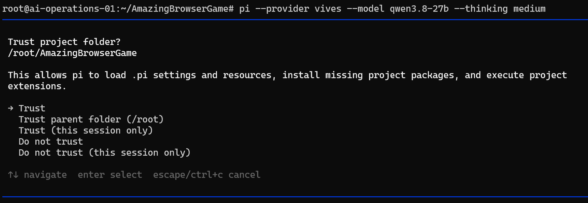
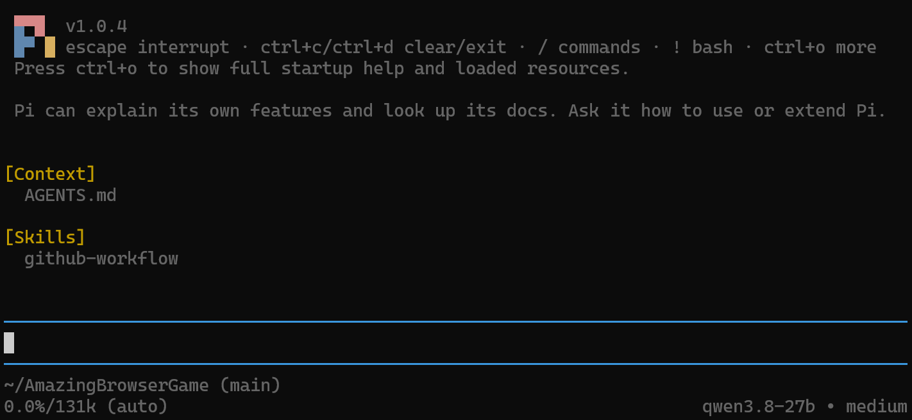
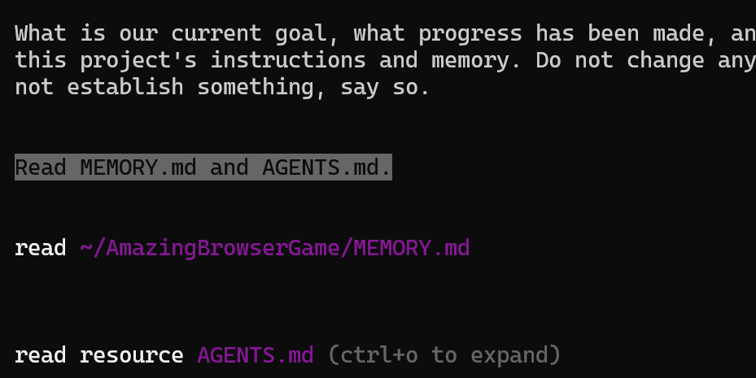
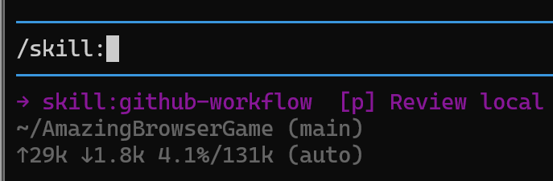
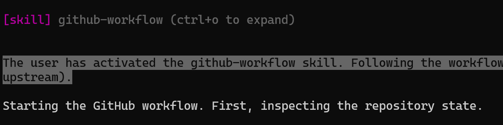
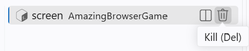
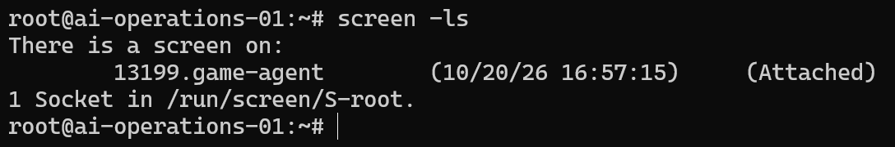

# 07 — Work with Pi in a persistent terminal

Your agent is working on a game improvement, but you want to close your
laptop. In this assignment, you will run **Pi**, a terminal coding agent,
inside **GNU Screen** on your development server. The server can keep
working on the task while you are disconnected. Later, you reconnect to the
same session and review the result.

You will keep the game, Qwen model, memory files and GitHub skill from the
previous assignments. Your VS Code agent will help prepare the new tools.
You will start Pi yourself and decide what work it should do.

## Understand what runs where

In [Assignment 03](03-develop-on-a-remote-server.md), you moved development to
your Linux server. Your laptop provides a window into that machine. Closing
the laptop does not shut down the server.

An **AI model** and a **coding harness** are different parts of the system.
Qwen generates responses and tool calls. The harness builds requests, runs
tools, manages the conversation and presents the result. VS Code Chat has
been your harness so far. Pi provides another one through a terminal.


Follow the Pi route in the diagram: your terminal reaches the development
server over SSH. Pi runs there, reads the game's files, executes commands
there and sends model requests to the school Qwen endpoint. **Qwen still
runs on the model server.** Installing Pi does not install the model in
your LXC.

The same division between model and tools appeared in
[Assignment 02](02-add-web-search.md#what-is-an-agent-tool). Changing the
harness changes the interface and some behavior, while our project and model
can stay the same. Pi's [overview](https://pi.dev/docs/latest) explains its role.

## Keep the project instructions you already built

Continue in the existing game repository. Its layout stays the same:

```text
YOUR-GAME/
├── AGENTS.md
├── MEMORY.md
├── .agents/
│   └── skills/
│       └── github-workflow/
│           └── SKILL.md
└── ...your game and any other skills
```

Pi can discover `AGENTS.md` and the project skill directory. Your existing
instructions tell it to read and maintain `MEMORY.md`. You do not need a
second copy of these files for Pi. Its private provider configuration lives
outside the game, in your Linux user's Pi configuration directory.

This transfers **recorded knowledge and working agreements**. It does not
transfer the VS Code chat itself: unsaved decisions from that chat are not
magically available in Pi. Before switching, ask your VS Code agent to bring
`MEMORY.md` up to date and review what it writes, as in
[Assignment 05](05-give-your-agent-a-memory.md). Pi documents its
[context files](https://pi.dev/docs/latest/configuration#context-files) and
[skill discovery](https://pi.dev/docs/latest/skills#add-it-to-pi).

## Let your VS Code agent prepare Pi and Screen

Open the game through VS Code Remote SSH on your assigned server, with Qwen
in Agent mode. The public [setup guide](resources/pi/README.md) and
[model template](resources/pi/models.example.json) let the agent prepare Pi
without logging in to the school's documentation website. Give it this prompt:

> Prepare this development server for Pi with the school's Qwen model and
> GNU Screen, following this guide and its linked model template:
>
> https://raw.githubusercontent.com/AlexanderDhoore/ai-operations/main/resources/pi/README.md
>
> Inspect the host and existing setup, explain the changes, then install only
> missing tools and configure the VIVES provider. Preserve existing settings,
> providers and game files, including AGENTS.md, MEMORY.md and .agents/skills.
>
> Verify Pi and screen in a new login shell and validate the configuration
> without displaying credentials. Do not read private key files or ask for
> secrets in chat. Tell me when to do the guide's private key-entry step myself.
>
> Summarize the changes and installed versions. Do not change game code,
> commit, push or launch Pi. I will start Screen and Pi myself.

Review the result, then follow the guide's
[private key-entry step](resources/pi/README.md#3-student-enter-the-key-privately)
in your server terminal. The key stays outside the game and chat.
Let the VS Code agent finish before switching to Pi.

## What Screen keeps alive

**Screen** provides a server-side terminal session. When its terminal connection
is lost, Screen detaches automatically by default. Programs inside it keep
running, and you can attach a new terminal later. See the
[GNU Screen manual](https://www.gnu.org/software/screen/manual/html_node/Detach.html).


In the middle panel, your display connection is gone, but Pi remains on the
LXC. It can finish the task and then wait for you. The server and model
connection must stay available. Screen does not recover crashes, survive a
server reboot or make the agent invent new tasks forever.

## Start the session yourself

In your VS Code Remote SSH terminal or an ordinary SSH connection, check the
server and any existing Screen sessions:

```bash
hostname
screen -ls
```

If `game-agent` already exists, [reattach to it](#reconnect-to-the-existing-session).
Otherwise, create it (“No Sockets found” means there are no sessions):

```bash
screen -S game-agent
```

Press Enter if Screen shows a welcome page. Inside Screen, **move into your
existing game repository**. Replace `~/YOUR-GAME` with its actual path, such
as `/root/AmazingBrowserGame` in our walkthrough:

```bash
cd ~/YOUR-GAME
pwd
```

Check that `cd` succeeded and `pwd` shows the game folder containing your
memory and skills. Then start Pi:

```bash
pi --provider vives --model qwen3.8-27b --thinking medium
```

If Pi asks, check the path and select **Trust** for your game folder.
You do not need to trust its parent folder.



Pi runs with your Linux user's permissions. The game folder and project trust
do not restrict its file access. See [Pi's permission model](https://pi.dev/docs/latest/security).

## Recover the goal and try your skill

Pi's startup information shows `AGENTS.md` under **Context**, `github-workflow`
under **Skills**, and Qwen in the footer. Press **Ctrl+O** if these details are
collapsed. This confirms discovery, before using the skill's full instructions.



Ask Pi:

> What is our current goal, what progress has been made, and what should we
> do next? Use this project's instructions and memory. Do not change anything
> yet. If the files do not establish something, say so.

Here it reads the existing memory and instructions:

<a href="assets/07-pi-memory-read.png"></a>

Check the answer against your recorded state. Discuss anything missing and
have Pi update the memory.

Now reuse the GitHub skill from [Assignment 06](06-teach-your-agent-a-skill.md).
Type `/skill:` to find it:

<a href="assets/07-pi-skill-picker.png"></a>

```text
/skill:github-workflow Review the current Git state and explain what work is pending.
Do not change files, stage, commit or push yet.
```

Pi shows the loaded skill and begins the review:

<a href="assets/07-pi-skill-loaded.png"></a>

The command differs from VS Code's `/github-workflow`, but `SKILL.md` is the
same. Check that it was loaded and review the result. If it is missing, check
the project directory and trust, then `/reload`. See the
[Pi skills guide](https://pi.dev/docs/latest/skills).

## Give Pi a task, then disconnect

Choose a small game improvement, discuss the intended behavior and have Pi
record the agreed plan in `MEMORY.md`. Then ask it to execute that plan:

> Implement the improvement we agreed on. Follow MEMORY.md, run relevant
> checks and keep memory updated. Stay within the agreed scope. If blocked,
> explain what you need and wait. Summarize the changes and checks when done.
> Do not commit or push yet.

While Pi works, **close the terminal**:

- **Windows Terminal or PowerShell with SSH:** close that terminal tab or window.
- **VS Code Remote SSH:** use the terminal's trash-can button, **Kill Terminal**.
  The panel's **X** only hides the view.

<a href="assets/07-vscode-kill-terminal.png"></a>

Close the outer terminal without exiting Pi or its Screen shell. The task can
continue on the server, even if you shut down your laptop.

## Reconnect to the existing session

Open a new terminal and reconnect as the same user to the same server.
From Windows Terminal or PowerShell, replace `XX` with your assigned number:

```powershell
ssh root@ai-operations-XX
```

In VS Code, reopen your Remote SSH workspace and choose **Terminal > New
Terminal** instead. On the server, find your session and reattach:

```bash
screen -ls
screen -d -r game-agent
```

Our walkthrough still showed **Attached**, meaning an old terminal connection
remained. **Detached** means no terminal is attached:

<a href="assets/07-screen-attached.png"></a>

`-d -r` handles both states by disconnecting the old terminal if necessary and
attaching here. Use it for your own session. A plain `-r` refuses an Attached
session, which can happen when VS Code preserves its terminal. See the
[Screen options](https://www.gnu.org/software/screen/manual/html_node/Invoking-Screen.html).

You return to the same Pi conversation. The task may be running, finished or
waiting for your input. Inspect what happened and the actual changes. If no
session is listed, check the server/user and whether Screen or the server
stopped before creating another.

## Finish the work and know when to stop

Review the changes and check the game. Have Pi fix any problems and update
`MEMORY.md` with the outcome and next step. When ready, use your GitHub skill
to review, commit and push the work, then check it on GitHub.

Close the outer terminal to leave Pi available. To end the session instead,
type `/quit` in Pi, then run `exit` in the Screen shell.

## Be ready to discuss

Be comfortable explaining where Pi and Qwen run, what survived disconnecting
your laptop, and how the existing memory and skill files helped you switch
harnesses. Talk about the task you tried, what happened while you were away
and how you checked the result.

In the next assignment, we will let a controller agent start background
workers. Here, you start and manage one Pi session yourself.
