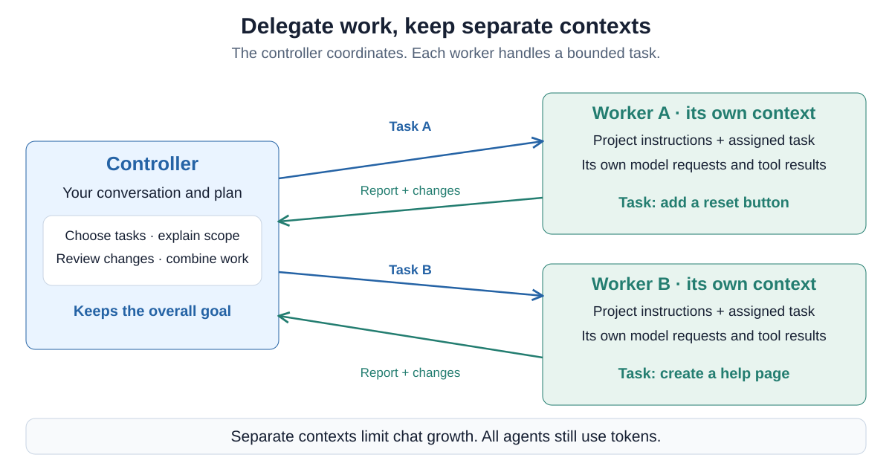
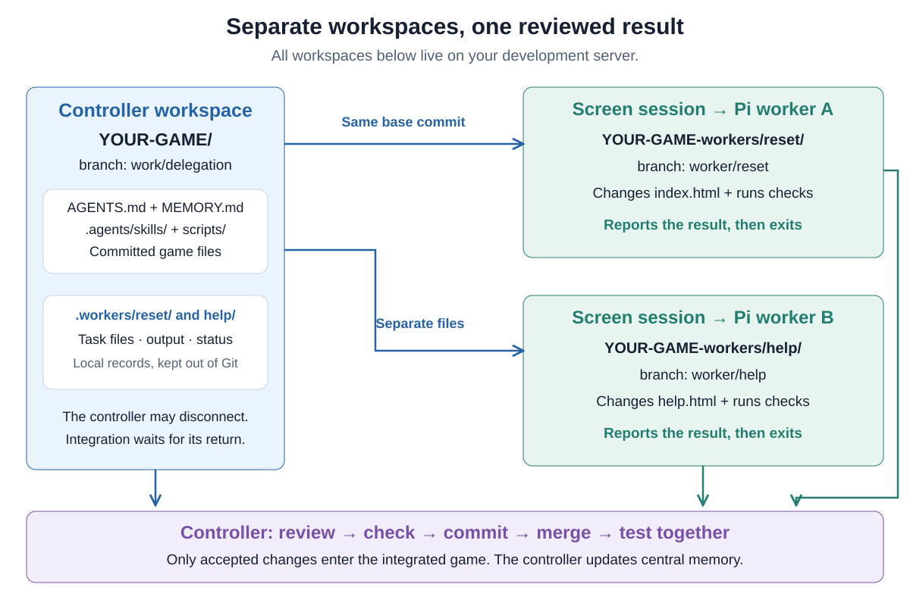
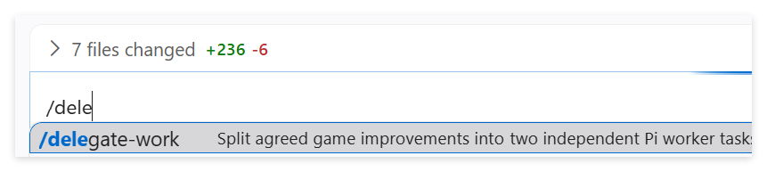
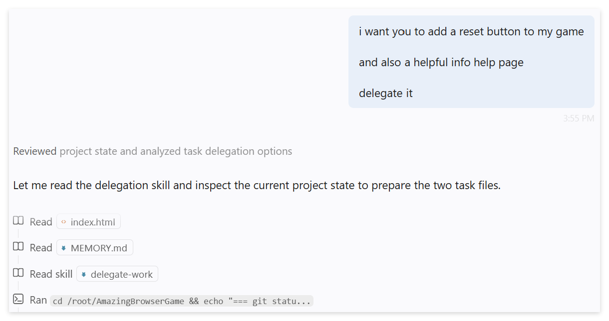

# 08 — Delegate work to coding agents

Your game needs two improvements. Instead of asking one agent to do everything
in sequence, you will let a **controller** divide the work between two
**workers**. Both workers change code. The controller reviews their results,
combines the changes and checks that the game still works.

You will build a small delegation system with your agent, using Pi, Screen
and Git. It extends [Assignment 07](07-work-with-pi-and-screen.md): the
controller starts the workers, and they can finish their assigned tasks even
when you close your laptop. You return later to review and integrate the work.

## What is a subagent?

A subagent is an agent that receives a task from another agent. It can read
files, use tools and return a result. Its work happens in a separate context,
so every file read and intermediate tool result need not fill the controller's
conversation. The controller still needs enough information to judge the result.

Coding harnesses such as [Codex](https://learn.chatgpt.com/docs/agent-configuration/subagents),
[VS Code](https://code.visualstudio.com/docs/agents/run/subagents) and
[Claude Code](https://code.claude.com/docs/en/sub-agents) offer subagent workflows.
Their details differ, including which context is passed along, available tools
and whether tasks run in parallel. Delegation is a harness feature, not a
special ability that only one model has.



Follow the arrows: the task travels out, and a result comes back. As in
[Assignment 05](05-give-your-agent-a-memory.md), useful context must be recorded
or explicitly provided. Our workers receive task files and project instructions,
not the controller's entire chat. Their requests still consume tokens. Separate
contexts reduce what accumulates in the controller's conversation, not all usage.

Three ideas matter here:

| Idea | What it means |
| --- | --- |
| Delegation | Another agent gets a bounded task and reports its result. |
| Parallel work | More than one task can make progress at the same time. |
| Independent lifetime | A worker can keep running after the controller disconnects. |

An asynchronous subagent is not automatically independent of its controller.
In our implementation, **Screen on the server keeps each Pi process alive**.
The controller does not need to remain open while those processes work.

## Choose your controller

The familiar baseline is **VS Code Chat with Qwen**, connected to your game
through Remote SSH. The workers also use Qwen, through Pi on the server.

You can use another coding client as controller if it can read and edit the
server's project files and run commands there. For example, eligible existing
subscriptions can provide access through [Codex](https://learn.chatgpt.com/docs/auth)
or [Claude Code](https://code.claude.com/docs/en/overview). Configure that client's
server access and project instructions before using it. Ordinary chat access
alone does not provide a server terminal.

You do not need a paid subscription for this assignment. **If you already have
one, try using a more capable GPT or Claude model as your controller.** Let it
plan the tasks, review the results and integrate the changes, while the
lower-cost Qwen workers do the implementation.

This is a useful orchestration pattern: use a stronger model where its judgment
adds value, and delegate suitable work to a cheaper model. Worker requests go
to the school endpoint instead of using your subscription allowance. Planning
and reviewing still use that allowance. Compare how well your controller
divides the work and catches problems in the workers' results.

## Give each worker its own files

Two agents editing one working directory can interfere with each other.
A **Git worktree** gives a branch its own checked-out directory while sharing
the repository's history. Each worker gets one branch and one worktree.
See the [Git worktree documentation](https://git-scm.com/docs/git-worktree).

There are **three working directories, one for each agent**:

- **Controller:** the original game folder, on the integration branch
  `work/delegation`. This is the repository's original worktree.
- **Worker A:** an additional worktree, on its own worker branch.
- **Worker B:** another additional worktree, on a different worker branch.

All three belong to the same Git repository and share its history. Each agent
has its own checked-out files. The controller reviews and combines the workers'
changes in the original game folder.



Both workers start from the same committed project state, including `AGENTS.md`,
`MEMORY.md` and `.agents/skills/`. They can read the same recorded knowledge.
The controller owns updates to central memory, while each worker reports its
own changes and checks separately.

Worktrees separate files, not permissions or shared databases and ports.
They also do not eliminate merge conflicts. Prefer independent tasks for this
first exercise. More workers will not necessarily make a shared Qwen server
faster, and reviewing their changes takes time too.

## Build the small launcher with your agent

Continue in your game on the development server. Pi and Screen should already
work from Assignment 07. Let your controller read the
[worker setup guide](resources/workers/README.md) and its linked reference files.
The reference is deliberately small enough to inspect and adapt.

Give your controller this prompt:

> Help me add the Assignment 08 delegation workflow to this game, following
> this guide and its linked reference files:
>
> https://raw.githubusercontent.com/AlexanderDhoore/ai-operations/refs/heads/main/resources/workers/README.md
>
> Read the guide and linked files, then inspect our project and explain your
> plan before making changes.
>
> Adapt the reference launcher into scripts/worker.sh, the worker role into
> scripts/worker-role.md, and the delegation skill into
> .agents/skills/delegate-work/SKILL.md. Preserve useful existing content.
> Add /.workers/ to .gitignore. Keep our existing Pi provider configuration.
>
> Reconcile AGENTS.md and our GitHub skill with this workflow. Workers execute
> tasks we already agreed on, report separately, and do not update central
> memory, commit or push. The controller reviews, commits and integrates.
> Record this working agreement: when I ask you to delegate agreed tasks,
> you may make the local plan commits needed to launch them. When I ask you
> to review and integrate their work, you may make the corresponding local
> commits and merges. Pushing or merging main still needs my request.
> Delegation means launch the workers, briefly verify they started, then
> return to me without waiting for completion. Include this in the skill.
> Preserve our normal collaboration rules outside delegated tasks.
>
> Check the Bash syntax and installed Pi options. Work on an integration
> branch such as work/delegation. Review the setup changes, update project
> memory and commit the files belonging to this setup. You are authorized to
> make that local commit. Preserve unrelated work and explain any blocker
> rather than committing or discarding it.
>
> Verify that the setup is committed, runtime files are ignored and the
> checkout is clean, ready for us to agree on worker tasks. Summarize what
> changed and how I can ask you to delegate work or check progress. Do not
> launch workers, change game behavior, push or merge main yet.

Review the files with the agent. Ask it to walk you through the command that
starts Pi. **`--print` means a non-interactive run**, not a read-only run:
Pi can edit and run tools, then exits after responding. The launcher supplies
the task, saves output and returns immediately. See [Pi's CLI modes](https://pi.dev/docs/latest/cli-integration).

This combines the previous lessons: instructions and memory describe the
project, a skill teaches a repeatable workflow, and a script handles the
mechanical steps. The agent helps build the system that delegates its work.

In VS Code, you can select `/delegate-work` to invoke the skill explicitly,
or ask the controller to use it in your own words:

<a href="assets/08-delegation-skill-picker.png"></a>

## Delegate through conversation

Choose two small improvements that can be worked on independently. A reset
button and a help page are one example. Your game might benefit from a scoring
function and a settings screen instead.

**Discuss each feature with the controller before delegating it.** Explain the
behavior you want, talk through important edge cases and agree on what a good
result looks like. Let the controller help identify dependencies between the
tasks. For a more complex game, this conversation gives each worker a much
clearer assignment.

Once you agree on the features, asking the controller to delegate can be short:

> Add a reset button to my game and a helpful page explaining the rules.
> Delegate the work. Check that the workers started, then come back to me
> without waiting for them to finish.

The screenshot deliberately uses a very short request to demonstrate the
workflow. For your own game, have that feature conversation first. The skill
then tells the controller how to turn your agreement into task files, commit
the plan and start separate workers. You do not need to repeat those procedural
instructions each time.

Here the controller reads the skill after a short request:

<a href="assets/08-delegate-through-chat.png"></a>

**The controller should check that the workers started, then return to you.**
It should not keep polling until their work is finished. If it does, steer it
with a message:

> Leave the workers running. Check briefly that they started, then return to
> me without waiting for them to finish.

In VS Code, type this while the controller is working and choose
**Steer with Message** from the Send dropdown. A queued message waits until
the current request finishes. See [VS Code's steering guide](https://code.visualstudio.com/docs/agents/guides/get-agent-back-on-track).

You can close your laptop as in Assignment 07. The workers continue their
assigned tasks on the server, then exit. Their results remain available when
you return.

For a glimpse underneath, the controller uses commands such as:

```bash
bash scripts/worker.sh start reset .workers/tasks/reset.md
bash scripts/worker.sh status reset
bash scripts/worker.sh result reset
```

These are examples of the controller's actions, not commands you need to type.

## Check progress and bring the work together

When you want an update, ask in the same chat, or reconnect to the game later:

> How are our workers getting on?

The controller checks the saved records, even in a fresh chat. When the work
is ready, continue the conversation:

> Review their work, fix any issues and merge the changes into our integration branch.

The skill covers inspecting the actual changes, running checks, committing the
accepted work, merging and checking the combined game. It also tells the
controller to update project memory. **A worker finishing does not mean its
code is correct.** Review is part of the controller's job.

Try the game yourself and discuss the result. Does reset work? Can you reach
the help page, and does it explain the actual behavior? When satisfied, ask
the controller to publish through your GitHub workflow and clean up the finished
worker worktrees. You stay in charge of what gets accepted and published.

## What could come next?

We deliberately built a small, visible workflow. It has no automatic retries,
crash recovery or continuously running coordinator. For larger systems, explore
Pi's [official subagent example](https://github.com/earendil-works/pi/tree/main/packages/coding-agent/examples/extensions/subagent),
extensions such as [pi-subagents](https://github.com/fitchmultz/pi-subagents), or
the experimental [Pi Durable library](https://github.com/earendil-works/pi/tree/main/packages/durable).
Compare how they handle task lifetime, results and isolation before adopting one.
You do not need to install them for this assignment.

## Be ready to discuss

Explain how you divided the work, where the controller and workers ran, what
continued after disconnecting, and how you decided the changes were ready to
combine. Discuss anything the controller caught during review and what you
would change about your next pair of tasks.
