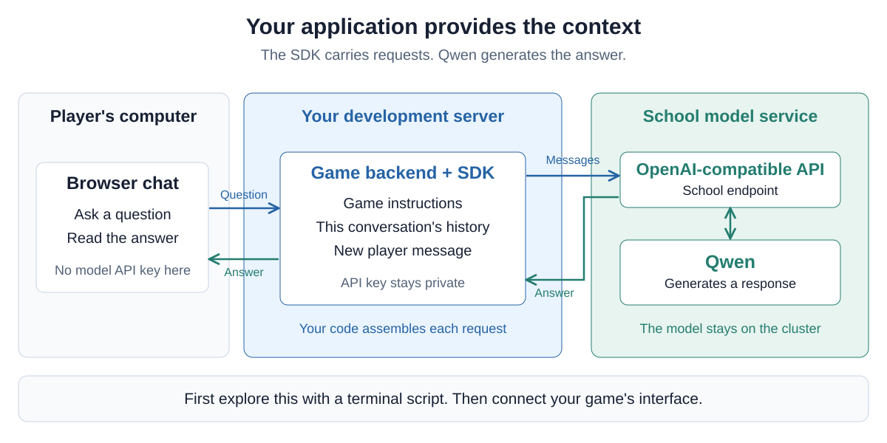
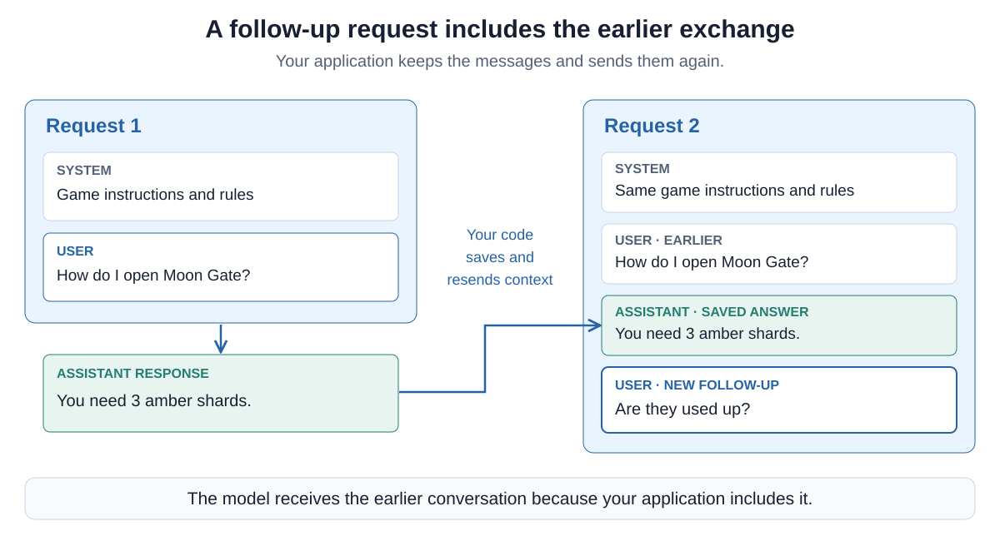
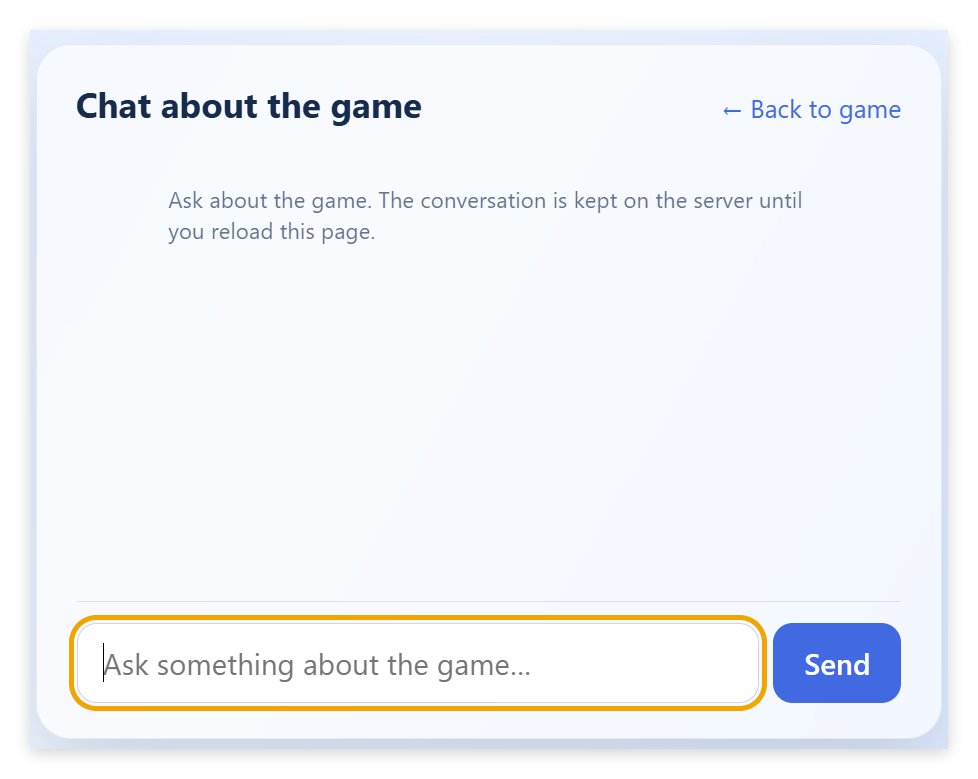

# 09 — Add an AI chat to your game


So far, AI has helped you **build** your game. Now you will make it part of the
game itself: a chat that explains the rules, controls and objectives to players.
You will still work with your coding agent, but the assistant inside your game
will be a feature of your own application.

Start with a small script so you can see what happens in a model request.
Extend it into a conversation, explore some further possibilities, then use
what you learned to build the game chat. Python is our example language. If
your backend uses another language, ask your agent to translate the pattern
with an appropriate SDK. Keep your existing game and technology choices.

## From a coding harness to an API

In [Assignment 07](07-work-with-pi-and-screen.md), we separated the **model**
from the **harness**. Qwen generates responses. VS Code Chat and Pi build its
context, manage conversations, execute tools and present the results.

Your application can talk to the model too. An **API** (application programming
interface) defines how a program sends a request and receives a response. An
**SDK** (software development kit) provides code for using that interface.
The OpenAI Python SDK handles the HTTP communication and gives us Python response
objects. Our application chooses the messages and decides what to do with the answer.

We use an **OpenAI-compatible API**, served by the school's Qwen cluster through
LiteLLM and SGLang. The SDK's name does not mean our requests go to an
OpenAI-hosted model. OpenAI's request format has become a common compatibility
convention, but providers do not necessarily implement every feature identically.
See the [Python SDK reference](https://developers.openai.com/api/reference/python).



For the first experiment, the terminal script takes the place of the game
backend. Later, the browser sends a question to that backend, which calls the
model. **The API key stays on the server.** The model is still on the school
cluster, not installed inside your game server.

## Make one request with your coding agent

Continue in the existing game folder on your development server. Give your
coding agent the [public SDK guide](resources/llm/README.md):

> Help me start the Assignment 09 SDK experiment in this game, following this
> guide and its linked request.py example:
>
> https://raw.githubusercontent.com/AlexanderDhoore/ai-operations/main/resources/llm/README.md
>
> Inspect our project and prepare an isolated environment for a small script
> at experiments/llm/chat.py. Explain the code and how to run it. Preserve our
> game and existing configuration, and keep the environment and secrets out
> of Git. Tell me when to load the key privately. Start with one request,
> without conversation history or a browser interface yet.

Let the agent help place the script and prepare its dependencies. Follow the
guide's private key step in your own terminal, then run the script. For the
Python example, the important code is:

```python
import os
from openai import OpenAI

with OpenAI(
    base_url="https://api.llm.mechatronics.be/v1",
    api_key=os.environ["VIVES_LLM_API_KEY"],
    timeout=60.0,
    max_retries=0,
) as client:
    response = client.chat.completions.create(
        model="qwen3.8-27b",
        messages=[
            {"role": "system", "content": (
                "Explain this fictional game briefly. Moon Gate opens with "
                "3 amber shards. The shards are not consumed. "
                "Say when the supplied rules do not answer a question."
            )},
            {"role": "user", "content": "How do I open Moon Gate?"},
        ],
        reasoning_effort="low",
        max_tokens=2048,
    )
    choice = response.choices[0]
    if choice.finish_reason != "stop" or not choice.message.content:
        raise RuntimeError("No complete answer. Check the output limit or try again.")
    print(choice.message.content)
```

This fictional gate is just an example, not a feature you need in your game.
Read the request with your agent. `base_url` selects the service, `model`
selects Qwen, and `messages` supplies the context. The **system** message gives
instructions and game information. The **user** message asks the question.
The result contains the **assistant** message.

`max_tokens` limits generated output, including Qwen's thinking. A short visible
answer can still need a larger token budget. The final check catches an answer
that stopped before completion. It does not check whether the answer is correct.
The timeout avoids waiting indefinitely, and
`max_retries=0` keeps the experiment to one attempt per request.

Try changing the question or a rule with your agent. Inspect the answer and
point to the part of the request that supplied the information.

The SDK is independent of coding harnesses such as VS Code Chat and Pi. It is
a Python library that talks to the LLM inference server. Your application supplies
the surrounding behavior, so you can build your own kind of harness. Here we
start with a chatbot and extend it in later assignments. The SDK does not
automatically read game files, `AGENTS.md` or `MEMORY.md`. Your code decides what
information to send and what capabilities the assistant has.

## Extend the script into a conversation

A request contains the context for that response. Running the one-request
script again does not give it the previous exchange. To support follow-up
questions, **your application sends the earlier messages again**.



Ask your coding agent:

> Extend this same script into an interactive conversation. Keep the system
> instructions and earlier user and assistant messages, and let me stop with
> /quit. Show me where the history is stored and how each request changes.

Your agent may structure the code differently. What matters is the context sent
with each request. For example, the messages for a follow-up might look like this:

```python
messages = [
    {"role": "system", "content": "Your game instructions and rules..."},
    {"role": "user", "content": "How do I open Moon Gate?"},
    {"role": "assistant", "content": "You need 3 amber shards."},
    {"role": "user", "content": "Are they used up?"},
]
```

Keep your actual game instructions in the first message. Build the conversation
loop with your agent, then inspect how it collects input, saves successful turns
and handles a failed request without saving an incomplete reply.

Ask a question, then a follow-up such as “Are they used up?” Discuss how the
previous messages make that question understandable. To check the history more
clearly, tell it a name for your character, then ask it to recall that name.
Restart the script and ask again without supplying the name. The model has only
what you send in that new conversation. See the [conversation context guide](https://developers.openai.com/api/docs/guides/conversation-state).

Your script can keep history in a Python list until it exits. A web application
needs a separate history for each user's conversation. Longer conversations
also fill the context and use more input tokens. Work with your agent to keep
history bounded while retaining the game instructions. We do not need a
database or automatic summarizer for this exercise.

## Two further possibilities

Before building the game interface, look at two things the API can also do.
**You do not have to implement either extension.** Use the small script if
you want to experiment with them.

### Return data the interface can use

A chat reply normally arrives as text. **Structured output** asks for an object
with defined fields. A JSON Schema describes those fields and their types.
For example:

```json
{
  "answer": "The shards are not consumed when the gate opens.",
  "suggested_questions": [
    "How many shards do I need?",
    "What happens if I do not have enough?"
  ]
}
```

Your interface could display `answer` as the reply and turn `suggested_questions`
into clickable buttons. Clicking one sends another user message. This connects
structured output to something useful in the chat interface.

To try this with your agent, add `response_format` to the request with a JSON
Schema describing those two fields. Your Python code can parse the returned text
with `json.loads()` and check the fields before using them. A schema helps with
the structure. It does not prove the answer is true. See the
[structured output guide](https://developers.openai.com/api/docs/guides/structured-outputs?api-mode=chat).

### Include an image in a question

The school model also accepts **text and images in the same request**. This is
multimodal input. For example, you could send a screenshot and ask it to describe
the visible interface. That does not give it access to the running game or to
information outside the image. We are using image understanding, not generating
new images.

To try this with your agent, have your script read a local image and encode it
as a base64 data URL. The user message's `content` becomes a list with a `text`
item and an `image_url` item containing that data URL, instead of just a string.
See the [official OpenAI image-input documentation](https://developers.openai.com/api/docs/guides/images-vision?api-mode=chat)
for Chat Completions examples, using our school endpoint and model.

The school allows up to **four images** sharing a pixel budget large enough for one
**4096×2160 image or four Full HD images**, with at most **40 MiB** of image
files. These are our school service's limits. Choose an image you are comfortable
sending to the service.

There are other useful implementation options too. **Text streaming** displays
an answer as it arrives. **Async requests** let an asynchronous backend do other
work while waiting for the model. Async does not make the model itself faster.
Your coding agent can help you decide whether either fits your application.

## Build a chat that explains your game to players

<a href="assets/09-game-chat.png"></a>

The terminal script let you explore requests and conversation history. Your task
now is to use those ideas to build an **in-game explanation chat**: a place in
your browser game where players can ask how the game works. Someone playing for
the first time might ask “What am I trying to achieve?” or “How do I move?” and
then ask follow-up questions. The assistant should explain your game's rules,
controls and objectives using the information you provide.

Build this feature together with your coding agent, adapting it to your own game.
**A text chat with conversation history is enough. Vision and structured output
remain optional.**

Discuss the feature with your coding agent before implementing it. Where should
the chat appear? What should it explain? Work together on a system prompt that
contains your game's rules, controls, goals and important terminology. It can
contain a substantial amount of game information. Review that information
against what the game actually does.

Then ask the agent to integrate the feature into your existing application.
If your game runs entirely in the browser, add a small backend for model requests.
If it already has a backend, extend that one in its existing language. Adapt the
request/history pattern from the script. Keep the key on the backend, preserve
each user's own history and show a useful message when a request fails. Render
model output as text or safely handled Markdown.

The assistant knows the information you supply. It cannot inspect live game
state or look up documents on its own yet. Have it say when a question needs
information it does not have. Keep hidden game information out of its context.
Later assignments will add deliberately restricted tools and document lookup.

Play the game and try the chat. Discuss its answers with your coding agent,
check that follow-up questions work and refine the instructions where needed.
You should be able to explain where the model runs, what each request contains
and where the application stores the conversation. Use your GitHub workflow
to review and publish the changes when you are satisfied.

Ask your coding agent to update the project memory with what you learned, what now works and what should happen next.
