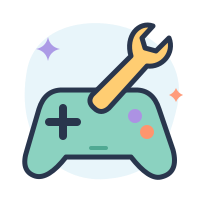
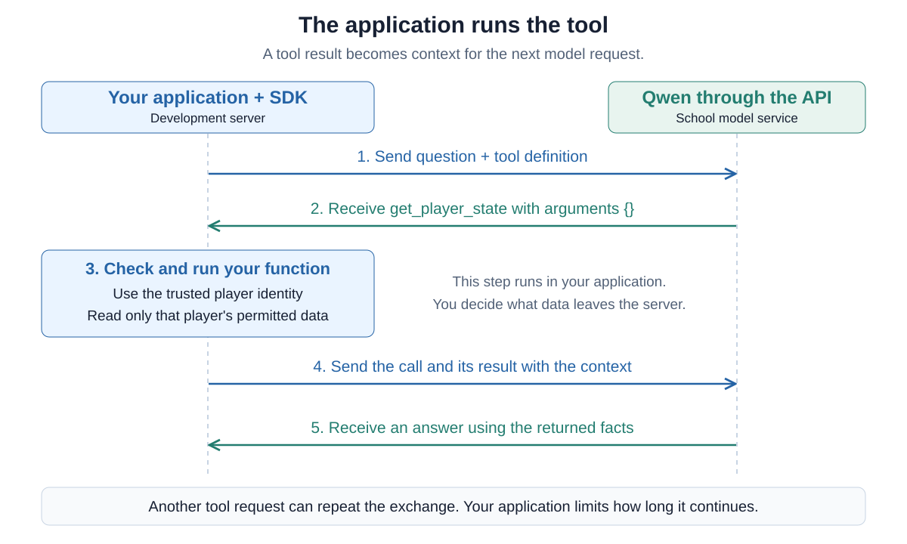
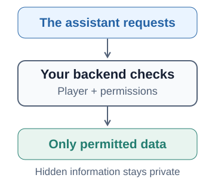

# 10 — Give your game assistant tools



Your [explanation chat](09-add-an-ai-chat-to-your-game.md) can describe the rules
you give it. A player may also ask about their current situation: what they are
carrying, where they are, or why an action is unavailable. Those answers need
information from the running game.

In this assignment, you will give the assistant **read-only tools** to request
that information. First explore a fresh Python starter with one working tool,
then add a second tool with your coding agent. Finally, extend the chat in your
own game. Your previous experiment script is not needed. Keep your existing
game and backend language for the final integration.

## A tool is a capability your application provides

A tool starts with an ordinary function, such as one that reads the current
player's inventory. You describe its name, purpose and arguments to the model.
The model can then return a **tool call** containing the function name and JSON
arguments. **Your application checks the request and runs the function.**
The model does not execute Python or gain access to your server by itself.

After running the function, your application sends its result back to the model.
The model can answer using those facts or request another tool. This is a small
agent loop, implemented in your own code using the same SDK as before.



For a small game, you could also include a current-state snapshot in every
request. Tools let the model ask for particular information when it needs it.
They do not train the model or permanently connect it to your database.
The [official function-calling guide](https://developers.openai.com/api/docs/guides/function-calling?api-mode=chat)
shows the Chat Completions format we use here.

## Explore a working tool with your coding agent

Continue in your game folder on the development server. Give your agent this
prompt, including the public setup guide:

> Help me explore Assignment 10 using this guide and its linked one_tool.py:
>
> https://raw.githubusercontent.com/AlexanderDhoore/ai-operations/refs/heads/main/resources/tools/README.md
>
> Prepare a fresh experiment at experiments/llm/tools.py. Check our existing
> environment and preserve our game and earlier experiments. Explain the starter
> and how to run it, including when I should load the key privately. Start with
> its one working tool so we can inspect the model requests and tool results.

Use the environment and private key step from the guide, then run the experiment
with the command your agent gives you.
The starter asks where the fictional player is and how many amber shards they
have. It prints the model requests, tool calls, returned data and final answer.
These traces make the exchange visible before there is a browser interface.

Read the function with your agent. In the starter, it looks like this:

```python
def get_player_state(player_id):
    """Return only this player's location and inventory."""
    if player_id not in PLAYERS:
        raise ValueError("No authenticated player.")
    state = PLAYERS[player_id]
    return {"location": state["location"], "inventory": dict(state["inventory"])}
```

`PLAYERS` is a small dictionary standing in for game data. The demonstration
selects Alice in `SESSION_PLAYER`. Her state contains a location and two amber
shards. Bob has different information. The function returns the selected
player's fields, not the whole dictionary.

The model receives a description of the tool in the request's `tools` list.
This is separate from the Python function:

```python
{
    "type": "function",
    "function": {
        "name": "get_player_state",
        "description": "Read the current player's location and inventory.",
        "parameters": {
            "type": "object",
            "properties": {},
            "required": [],
            "additionalProperties": False,
        },
    },
}
```

This **tool definition** tells the model what it may request. It permits no
model-supplied arguments. Although the Python function takes
`player_id`, our code supplies that value. In a real game, the trusted player
session determines it. The tool definition sends neither the function's code nor
the player dictionary to the model.

Inspect the output with your agent. Find the request for `get_player_state`,
the returned location and inventory, and the answer that uses them. Change Alice's
shard count in the experiment and run it again. Check that the returned data and
answer reflect the change. The tool is reading the current value.

## Follow the result back into the conversation

In the starter, `dispatch` checks the requested tool name and arguments before
calling an allowed function. The `answer_question` loop keeps the model's tool
request and adds a result message like this:

```python
{
    "role": "tool",
    "tool_call_id": call.id,
    "content": json.dumps(result),
}
```

The ID connects this result to the specific call the model requested. Sending
the assistant's tool request and its result in the next model request lets the
model use that information. Several tools may be requested in one response,
so each needs its own result. A normal answer with no tool calls ends the loop.

Ask your agent to show where the starter stops if the model keeps requesting
tools or a response is incomplete. It limits both model requests and tool calls,
and each request has a timeout. The model chooses among available capabilities,
while the application controls execution and when to stop.

## Add a second tool

Extend this experiment together with your coding agent. Add a read-only tool
that accepts a **gate name** and returns its opening requirements from a small
dictionary. For this fictional example, Moon Gate requires three amber shards.
Set Alice's inventory back to two shards so we can check what she is missing.
Have the tool return a useful error for an unknown gate name.

Discuss the function, its description and argument schema before asking the
agent to implement it. Unlike the first tool, this one takes an argument from
the model. Your code must check its name, type and permitted values before use.
Update the tool catalog and dispatcher together. A JSON Schema describes the
expected arguments. Your backend still validates them.

Run the extended script with a question that needs both tools, such as:

> Can I open the gate at my current location? If not, what am I missing?

Inspect the calls and results with your agent. With two shards and a requirement
of three, the answer should identify the missing shard. Change the inventory or
requirement and try again. Keep these facts in the tool results so the model has
to obtain them. Moon Gate and shards are teaching examples, your own game can
have completely different mechanics.

## Keep the game's boundaries in your code



The coding agent helps build your application and may have broad development
tools. The assistant inside your game receives only the functions your backend
exposes. Start with read-only tools. A tool for reading inventory needs no shell,
arbitrary SQL or filesystem access.

Read-only access can still reveal hidden information. Use the backend's trusted
player session to identify the player, then return only what that player may see.
An opponent's hidden cards must stay unavailable even if the player asks the
assistant for them. A prompt saying “do not reveal secrets” does not implement
that restriction. The starter's fixed `SESSION_PLAYER` is only a demonstration,
not a login system.

Earlier tool results in chat history are earlier observations. When a question
needs current game state, fetch it again. Treat a failed lookup as missing
information, not as an invitation to invent a value.

## Let your game chat inspect the player's situation

Your task now is to extend the explanation chat from Assignment 09 with **at
least one useful read-only capability backed by actual game state**. A player
should be able to ask something that the rules alone cannot answer. Choose
capabilities that fit your game, such as reading the player's status, visible
surroundings or available resources.

Discuss those questions with your coding agent, then adapt the mechanism from
the experiment to your existing backend. Keep the API key, argument checks and
player permissions there. Preserve the chat's conversation history and keep
different players' conversations separate. Plain-text answers are sufficient.
Your agent can help inspect tool activity in development logs.

Play the game and ask about the current situation. Change something through
normal gameplay, ask again and inspect the fresh tool result. Check that the tools
return only information this player may see, and that unavailable data produces
a useful explanation. You should be able to point to the function that read the
state and explain how its result reached the model.

## Optional: make the chat part of gameplay

Tools can also **change game state**. Perhaps a player asks the assistant to equip
an item, move their character or offer a trade. The chat can become a way to play
the game, not just ask about it. Discuss an idea that fits your game with your
coding agent and try one small action tool. The read-only integration above is
sufficient for this assignment.

Have the tool use your backend's normal game actions, with the same player
permissions, costs and rules as a button in the game. Check the current state
when executing, report what actually happened and prevent a repeated request
from applying the same action twice. For an action that spends scarce resources
or cannot easily be undone, let the player confirm it before execution. The model
requests the action, your game code decides whether it is allowed.

## Review your work

Review and publish your changes through your existing GitHub workflow. The next
assignment will use tools again, this time to look up game documentation and lore.

Ask your coding agent to update the project memory with what you learned, what now works and what should happen next.
