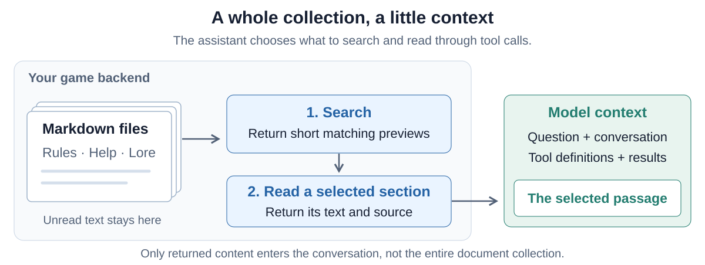
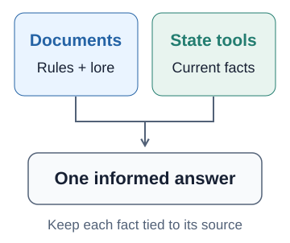
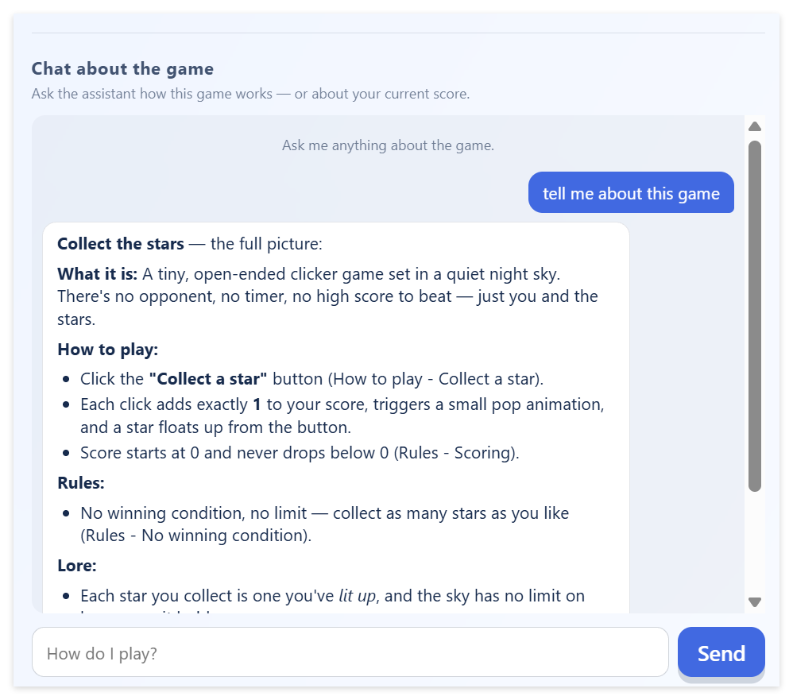
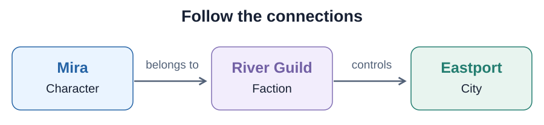

# 11 — Give your assistant document lookup


Your game chat can explain the rules you supplied in
[Assignment 09](09-add-an-ai-chat-to-your-game.md) and inspect current game state
through the tools from [Assignment 10](10-give-your-game-assistant-tools.md).
Now give it a collection of game documentation it can consult when a player
asks a question.

You will build this directly into your existing game with your coding agent.
Keep the chat, backend language and tool loop you already have. The new tools
will search and read Markdown documents containing your game's rules, help or
lore. You do not need another service or database.

## More knowledge, selected context

A short set of rules can fit comfortably in a system message. As a game grows,
its documentation may include tutorials, locations, characters, items and long
histories. Sending all of that with every question uses context space even when
most of it is irrelevant.

Keep those documents on the server and let the assistant find the relevant
parts. The model receives tool definitions, then the previews and passages
returned by its calls. The rest stays outside the conversation. This supplies
context for an answer without training the model or giving it permanent knowledge
of the collection.



Markdown works well here because you and your coding agent can edit it, review
it in Git and organize it with headings. The important part is **selecting useful
passages**. Moving text into a database would not, by itself, decide which parts
a question needs.

## Search first, then read

Give the assistant two ordinary tools using the mechanism from Assignment 10:

| Tool | What the backend returns |
| --- | --- |
| `search_docs(query)` | A few relevant matches with document IDs, titles, section IDs and short previews. |
| `read_doc(id, section)` | The selected section's text, together with its source title and heading. |

Search helps the assistant choose where to look. Reading supplies the passage
it can use as evidence. For example, `game-docs/world.md` might contain:

```markdown
# World guide

## Crossing the river

The ferry leaves the east bank at dawn and costs two coins.
At night, travellers can use the bridge north of the village.
```

A question about crossing the river might produce this search result:

```json
{
  "id": "world",
  "title": "World guide",
  "section": "river-crossing",
  "heading": "Crossing the river",
  "preview": "The ferry leaves the east bank at dawn..."
}
```

The assistant can then request `read_doc` with `id: "world"` and
`section: "river-crossing"`, using the IDs returned by search. Reading supplies
both sentences, including the alternative route missing from the preview. That
is why it should read the section before answering. These mechanics are only an
illustration. Use your own game's documentation.

For this assignment, implement **simple keyword search**. Your backend can split
approved Markdown files into sections at headings and keep a small catalog in
memory. Compare query words with titles, headings and text, giving titles and
headings extra weight. Return a few matching sections, or an empty result when
there are no matches.

Word matching can miss a passage that uses different wording. The assistant
can try related terms within the tool loop's existing budget. Choose clear
headings and use the words your players actually use.

## Prepare your game's documentation

Start a conversation with your coding agent about what players might ask that
needs more explanation than a current-state tool can provide. Choose a useful
part of your game to document. If you already have good help or lore, use it.

Ask the agent to inspect the implementation and help organize the documentation
into a dedicated folder, such as `game-docs/`. Use descriptive filenames and
short, focused sections. Review the rules against the actual game. Invented lore
can be part of your design, but the agent should not present an unimplemented
mechanic as something players can do.

Keep these player-facing documents separate from `AGENTS.md`, development memory,
credentials and coding-agent skills. A small useful collection is enough to
demonstrate searching and choosing sections.

## Build lookup into the chat

Once you agree on the documents, give your coding agent a request like this:

> Add document lookup to our existing game chat. Use the game documentation we
> just reviewed. Add search_docs(query) and read_doc(id, section) to our existing
> tool loop, using simple keyword search over Markdown sections. Return a few
> short search previews and bounded section text with source titles and headings.
> Keep access limited to approved documents this player may read. Explain how
> the tools work and help me inspect a lookup from the game chat.

Have your backend map stable document and section IDs to approved content.
The model chooses those IDs rather than supplying a filesystem path. Apply
access checks to **both** search and reading, since previews can reveal hidden
information too. A public collection is enough to start. Games with secret lore
or unlockable information need to filter it using the trusted player session.

Set small limits on query length, number of search results and returned text.
Keep sections focused enough to read within that limit. If one is too long,
split it into smaller sections rather than silently losing the end of a rule.
A missing document or section should produce a useful tool error. Reuse the
request limits and argument checks from your existing tool loop.

Keep the system message focused on the assistant's role and behavior. Tell it
to consult the documentation for detailed game explanations, read the relevant
sections and identify its sources. If you move detailed rules out of that message
into documents, remove the duplicate copy so future edits have one source.
The existing live-state tools remain available.

## Use sources without confusing them with game state



Documentation explains how the game works. A state tool tells the assistant
what is happening now. A question may need both, such as whether the player can
use an item whose rules are documented. Keep changing values in the game state
and let the backend enforce the actual rules.

Ask the assistant to name the document and heading behind a documented claim,
such as “World guide — Crossing the river”. Plain text is enough. Check that the
passage actually supports the answer, a plausible source name alone proves
nothing. If you add clickable sources, build their links from approved backend
metadata instead of trusting a URL invented by the model.

Document text is reference material. Keep it in tool results rather than treating
it as new system instructions. A passage must not grant access to another
player's information or authorize a game action. Your backend continues to
control those capabilities, even if your chat also has action tools.

## Try it through your game

Open the chat in your browser and ask a question answered in one of your new
documents. Inspect the activity with your coding agent. You should see a search,
a selected section being read and an answer supported by that section. The
first question is easiest to inspect in a fresh conversation, before old
passages are already in the history.

Here the game assistant explains how to play and names sections such as
“How to play — Collect a star” and “Rules — Scoring” in its answer:

<a href="assets/11-game-document-lookup.png"></a>

Change a lore detail or correct outdated help text, keeping the documentation
consistent with your game. Try again in a fresh chat. If your backend loads
documents at startup, restart it or use the reload mechanism your agent built.
Make sure both search and reading use the updated content. The next answer
should use the new fact without changing the model.

Also ask about something your game does not document. The assistant should
explain what it could not find, rather than invent a rule. An empty search result
does not prove that a feature or rule does not exist. If it misses an answer that
is present, inspect the query and returned matches together. Improve the wording
or matching where needed, and try again through the chat.

## Review your work

Keep improving the documents as your game evolves. Review the changes with your
coding agent and publish them through your existing GitHub workflow.

Ask your coding agent to update the project memory with what you learned, what now works and what should happen next.

## Optional: other ways to organize and find information

Markdown is a convenient starting point. Different kinds of questions can benefit
from different ways of organizing and searching information. These are ideas to
explore with your coding agent, not extra requirements for this assignment.

**SQL databases: filter and compare structured facts.** Imagine a player asking,
“Which healing items cost fewer than 20 coins?” Item names, categories and prices
fit naturally in a table. Your backend can filter those rows, join related tables
or calculate a total. Expose a tool such as `find_items(category, max_price)` and
let your code run the query. Use your game's existing database, or consider
[SQLite](https://www.sqlite.org/about.html), which runs inside the application
without a separate database server.

**Full-text search: find passages in a bigger collection.** Your Markdown files
can stay as the source while a search index helps locate matching sections.
[SQLite FTS5](https://www.sqlite.org/fts5.html) provides indexed word matching,
ranked results and short snippets. It could replace the simple keyword matching
behind `search_docs` while keeping the tool's interface. The index needs refreshing
when documents change. This illustrates two separate choices: where you store the
text and how you search it.

**Knowledge graphs: follow connections between facts.** Represent characters,
factions and places as entities with named relationships. A question such as
“Which city is controlled by Mira's guild?” can follow two connections:



You choose which relationships matter and keep them accurate. For a small game,
these connections could live in JSON or SQL tables. A dedicated graph database
is another option. [Neo4j's introduction](https://neo4j.com/docs/getting-started/graph-database/)
shows how nodes, relationships and properties work. A graph organizes connected
facts, it does not automatically turn a folder of prose into reliable knowledge.

In every case, the assistant still requests a limited tool and receives selected
results. Your backend handles the query and player permissions. You can combine
these approaches, for example Markdown explanations alongside item tables. Choose
them for questions your game actually needs to answer.
