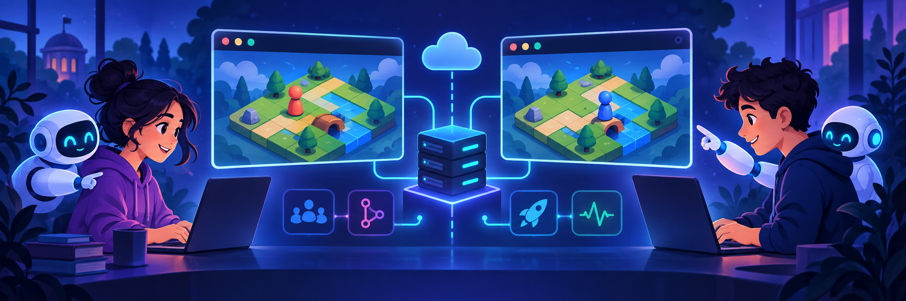

# AI Operations

> **Course slogan:** You have to understand what you're building.

In this course, you will design, build, and operate a browser-based multiplayer
game. Your game is the project that connects the whole semester: you will first
use AI to help write software, then develop the practices needed to keep that
software understandable, testable, deployable, and observable. Later, you will
also explore how to integrate AI into the application itself.

You choose the game and the technologies. There is no prescribed frontend,
backend, language, or framework. Research your options, explain your choices,
and keep the scope small enough that you can make the game work end to end. By
the end of the course, people should be able to join the same game from
separate browsers and affect a shared game state.

## Topics we may explore

We begin by building a small version of the game on your own computer with
VS Code Chat and the Mechatronics LLM cluster. As the course develops, we may
explore topics such as:

- Collaborating through GitHub, pull requests, and AI-assisted code review.
- Checking changes with tests and GitHub Actions.
- Developing in a consistent remote environment and deploying the game.
- Using logs, metrics, and dashboards to understand a running application.
- Integrating an AI capability into the game itself.

These are examples, not a fixed sequence or a complete list of requirements.
Each new assignment will explain what applies at that stage. You will use
official documentation, your AI assistant, experiments, and discussions with
other students to work out the implementation.

## What you are responsible for

An AI assistant can generate code and suggest commands, but you are the
engineer responsible for the result. Be able to explain the application's
architecture, the libraries you chose, how browser and server communicate,
how you test and deploy changes, and how you know the running game is healthy.
You do not need to memorize every line of code. You should be able to find the
important parts of your codebase and explain how they fit together.

At the end of the semester, you will demonstrate your live game and defend
your work in a conversation with the instructor. We should be able to inspect
the running system, examine the code and its development workflow, and make a
new deployment. The central question is the same as on day one: **do you
understand what you built?**

## Assignments

- [01 — Start building with VS Code Chat](01-start-building-with-ai.md)
- [02 — Add web search to your AI assistant](02-add-web-search.md)

Later assignments will appear here when their requirements are introduced in
class.
