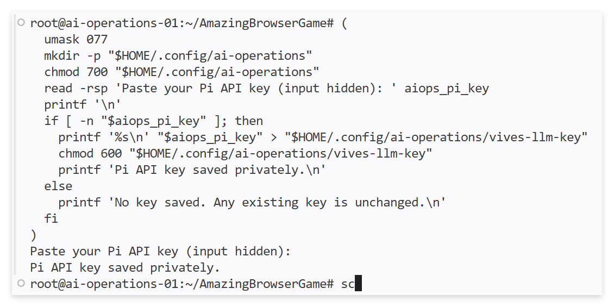

# Pi setup for the AI Operations development server

This public guide is for the student and their VS Code agent. It supplies the
course-specific setup for Assignment 07, "Work with Pi in a persistent terminal".
Use it on the student's assigned Debian development server, as the same Linux
user who owns the game. The agent prepares the tools and configuration. The
student supplies their personal API key privately.

The [model template](models.example.json) contains no API key. When reading
this guide through a Raw URL, resolve the template link relative to that URL.

## 1. Inspect and install the tools

Check the host, working directory, existing Pi installation and GNU Screen.
Preserve the game files and any existing Pi configuration. If Pi is missing,
follow the current [official Linux installation instructions](https://pi.dev/docs/latest/quickstart#1-install-pi).
The official installer is an option even if Node.js is not installed. Use the
prerequisites for the installation method you choose. Do not install a second
copy over a working setup or upgrade unrelated software.

Install the Debian `screen` package if needed. Confirm that these commands
work in an ordinary terminal and in a new login shell for the same user:

```bash
pi --version
screen --version
```

If Pi's installation directory is not on PATH, follow its installation
instructions to fix the user's PATH. Both VS Code's terminal and a later SSH
login should find the same executable.

## 2. Add the VIVES provider

Pi reads user model configuration from `~/.pi/agent/models.json`. Use the
[template](models.example.json) to add `providers.vives` there.

- For a new configuration, create the directory and use the template.
- For an existing configuration, preserve the other providers and settings.
  If `vives` already exists, compare it with the template and discuss any
  meaningful differences before replacing that entry.
- Validate the resulting JSON without printing existing credentials. Keep
  the directory private and set `models.json` to mode `600`.
- Leave the `apiKey` field as the command reference in the template. Do not
  substitute a student's secret into the public template or any game file.

The provider is named `vives`. Its model is `qwen3.8-27b`. The API endpoint is
`https://api.llm.mechatronics.be/v1`. This connects to the school model server.
It does not download Qwen into the student's LXC.

The `apiKey` value starts with `!`, which tells Pi to run a credential command
and use its output as the key. Here, Pi reads a private file under the user's
home directory. This avoids depending on an environment variable exported
in a previous SSH session. See [Pi's endpoint configuration](https://pi.dev/docs/latest/models#configure-a-compatible-endpoint).

## 3. Student: enter the key privately

Create a personal key for Pi using the school's LiteLLM portal, as introduced
in [Assignment 01](../../01-start-building-with-ai.md). The portal can still
require a browser login. The agent does not need access to it. Keep your
existing VS Code key/configuration intact.

Run the following block **yourself in a Bash terminal on your development
server**, outside Pi or a chat prompt. Paste the key only when the hidden
prompt appears. A blank entry leaves an existing key unchanged.

```bash
(
  umask 077
  mkdir -p "$HOME/.config/ai-operations"
  chmod 700 "$HOME/.config/ai-operations"
  read -rsp 'Paste your Pi API key (input hidden): ' aiops_pi_key
  printf '\n'
  if [ -n "$aiops_pi_key" ]; then
    printf '%s\n' "$aiops_pi_key" > "$HOME/.config/ai-operations/vives-llm-key"
    chmod 600 "$HOME/.config/ai-operations/vives-llm-key"
    printf 'Pi API key saved privately.\n'
  else
    printf 'No key saved. Any existing key is unchanged.\n'
  fi
)
```

The walkthrough shows the hidden prompt and confirmation, with no key visible:

<a href="../../assets/07-pi-key-saved.png"></a>

The subshell discards the temporary variable when it exits. The key persists
in the private file, so future Pi sessions can read it. The file is plain
text protected by Linux permissions. It is outside the game repository.
Do not display its contents, run the key-reading command in chat, or include
the key in screenshots. The agent can check whether the file exists and is
non-empty without reading its value.

## 4. Start from the game folder

After the student has entered the key, follow Assignment 07 to start a
`screen` session. Inside it, change into the existing game repository.
Replace `~/YOUR-GAME` with its actual path and check that `cd` succeeds:

```bash
cd ~/YOUR-GAME
pwd
```

Once `pwd` shows the game folder, start Pi:

```bash
pi --provider vives --model qwen3.8-27b --thinking medium
```

Use a first request that only inspects the project. If Pi asks whether to
trust the project, review the path and resources before trusting your own
game. Project trust is separate from tool permissions: Pi can execute commands
as the Linux user running it. See [Pi's security explanation](https://pi.dev/docs/latest/security).

If authentication fails, check the endpoint, model, Linux user and whether
the private key file is present. The student can inspect key validity in the
portal. Never diagnose authentication by printing the key. Starting Pi and
receiving an answer is the actual connection test. Valid JSON alone is not.

## Configuration provenance

The non-secret endpoint, model limits and compatibility fields were copied
from the Mechatronics LLM configuration on 7 October 2026. This public extract
lets agents set up the client without logging in to the protected handbook.
Only credential handling differs: a private file reference replaces an
embedded key.

For maintainers, the source is `mechatronics-docs/docs/llm.md`, under
"Pi coding harness". When the school endpoint or Pi configuration changes,
compare this template with that source and verify it against the installed
Pi version. The assignment's setup prompt follows the `main` branch of this
course repository. Keep this guide and the template in sync when updating
that branch.
